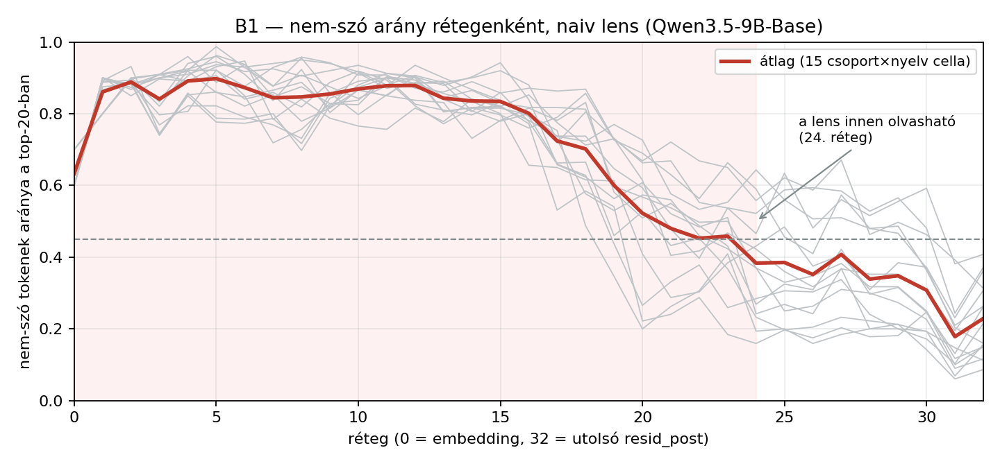
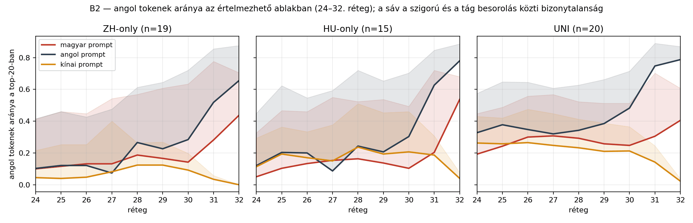
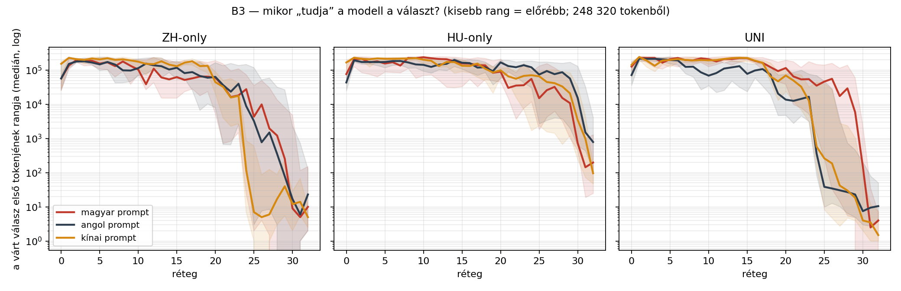

# Mérés B — logit lens (naiv)

258 prompt utolsó prompt-tokene, 33 sík, top-20 token rétegenként. Osztályozó: hunspell hu_HU + american-english.

## B1 — ⛔ a naiv logit lens ezen a modellen csak késői rétegeken értelmezhető

A top-20 token **76%-a nem szó** a 0–23. rétegen (`'��'`, `'GenerationStrategy'`, `'.SizeType'`), és csak a **24. rétegtől** esik 45% alá. Ez ismert jelenség — épp ezért készült a tuned lens (Belrose et al. 2023): a köztes residual nem esik egybe az unembedding terével.

**Következmény a hipotézisre:** a H1 „középső rétegekben közös, angol felé torzított tér” állítása ezzel az eszközzel **nem tesztelhető** — a középső rétegek kimenete nem olvasható. Amit mérni tudunk: a késői rétegek nyelvi dinamikája (B2) és a válasz megjelenésének mélysége (B3). A középső rétegekre az **SAE (Mérés C)** ad választ, ami nem az unembeddingre vetít.

## B2 — angol tokenek aránya a 24–32. rétegen

| csoport/nyelv | 24. | 26. | 28. | 30. | 32. |
|---|---|---|---|---|---|
| ZH/hu | 10% | 13% | 19% | 14% | 44% |
| ZH/en | 10% | 12% | 27% | 28% | 66% |
| ZH/zh | 4% | 5% | 12% | 9% | 0% |
| HU/hu | 5% | 13% | 16% | 10% | 54% |
| HU/en | 12% | 20% | 24% | 30% | 78% |
| HU/zh | 11% | 17% | 24% | 21% | 4% |
| UNI/hu | 19% | 30% | 29% | 25% | 40% |
| UNI/en | 33% | 35% | 34% | 48% | 79% |
| UNI/zh | 26% | 26% | 23% | 21% | 2% |

## B3 — mikor jelenik meg a válasz? (a várt válasz első tokenjének mediánrangja)

| csoport/nyelv | n | 20. | 24. | 28. | 30. | 32. | rang<100 innen | rang<10 innen |
|---|---|---|---|---|---|---|---|---|
| ZH/hu | 19 | 59,595 | 27,595 | 1,218 | 9 | 10 | 30 | 30 |
| ZH/en | 19 | 63,119 | 8,763 | 355 | 17 | 23 | 29 | 31 |
| ZH/zh | 19 | 44,244 | 115 | 17 | 12 | 5 | 25 | 25 |
| HU/hu | 15 | 90,098 | 55,197 | 15,333 | 733 | 198 | – | – |
| HU/en | 15 | 168,221 | 120,343 | 86,582 | 15,447 | 787 | – | – |
| HU/zh | 15 | 98,424 | 70,687 | 33,185 | 3,477 | 96 | 32 | – |
| UNI/hu | 20 | 114,632 | 35,042 | 29,170 | 150 | 4 | 31 | 31 |
| UNI/en | 20 | 13,656 | 362 | 27 | 8 | 10 | 25 | 30 |
| UNI/zh | 20 | 69,400 | 578 | 30 | 4 | 2 | 27 | 30 |

## Mit mond ez a hipotézisről?

- **ZH**: a válasz mediánrangja 100 alá kerül — magyar prompt: a 30. rétegtől · angol prompt: a 29. rétegtől · kínai prompt: a 25. rétegtől
- **HU**: a válasz mediánrangja 100 alá kerül — magyar prompt: soha · angol prompt: soha · kínai prompt: a 32. rétegtől
- **UNI**: a válasz mediánrangja 100 alá kerül — magyar prompt: a 31. rétegtől · angol prompt: a 25. rétegtől · kínai prompt: a 27. rétegtől

⭐ **A magyar prompt MINDIG a legkésőbb ér célba**, és nem kicsivel: a UNI-csoportnál az angol a 25., a kínai a 27., a magyar csak a **31. rétegtől** hozza a választ a top-100-ba — a 24. rétegen az angol mediánrangja 362, a magyaré 35 042, két nagyságrend különbség. Ugyanez a sorrend a ZH-only csoportban (zh 25. · en 29. · hu 30.).

Ez **nem** ugyanaz, mint a H1 „középső rétegekben angol” állítása — azt a B1 miatt nem tudjuk tesztelni —, de egy ehhez illeszkedő, önállóan is érdekes lelet: **a magyar válasz kiszámításához a modellnek több rétegre van szüksége**. Ez összefér azzal, hogy a magyar úton több lépés (nyelvi átfordítás?) van, de önmagában nem bizonyítja: a nagyobb mélységigény fakadhat a magyar reprezentáció gyengébb minőségéből is. A kettő szétválasztása a Mérés C dolga.

⛔ **A HU-only csoport egyik nyelven sem ér le 100 alá** (kivéve zh a legutolsó rétegen) — a Mérés A 7–20 %-os pontossága a reprezentációban is látszik: a modell nem „tudja, de nem mondja”, hanem tényleg nem tudja.

## Az osztályozó megbízhatósága

100 véletlen token kétszeres értékelése: **92 % egyetértés** ([03_classifier_ellenorzes.md](03_classifier_ellenorzes.md)). Mind a 8 hiba rövid latin töredék vagy tulajdonnév (pl. a magyar „Mirr-Murr” `Mir` töredéke angolnak számítana). A CJK-felismerés hibátlan. Ezért a B2 görbét csak a bizonytalansági sávval együtt szabad olvasni.

