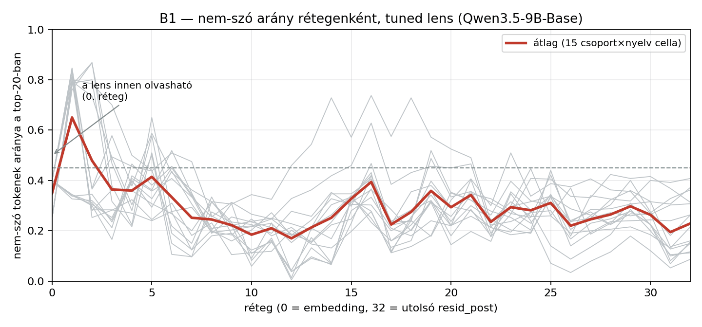
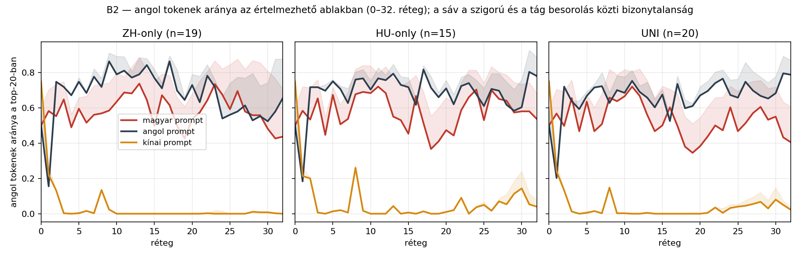
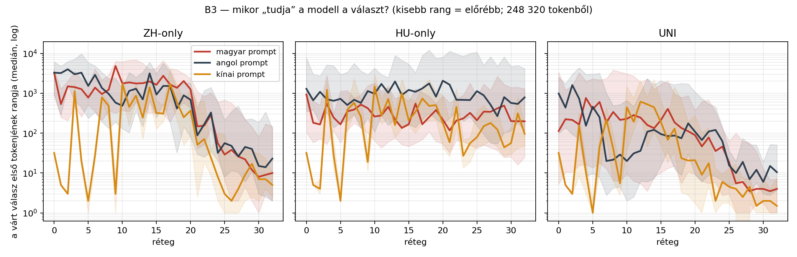

# Mérés B — logit lens (tuned)

258 prompt utolsó prompt-tokene, 33 sík, top-20 token rétegenként. Osztályozó: hunspell hu_HU + american-english.

## B1 — a tuned lens a középső síkokat is olvashatóvá teszi

A középső (0–23.) síkok átlagos nem-szó aránya **31%** (a naiv lens 76%-ával szemben); a 45%-os küszöböt ebből a tartományból 2 sík lépi át. A B2 nyelvi görbéi ezért itt a teljes mélységben olvashatók.

⛔⛔ **Cserébe a fordító visszaszivárogtat:** a rétegenkénti fordítók a VÉGSŐ eloszlás KL-jére tanultak, tehát részben elvégzik a hátralévő számítást. A B3 válasz-rang görbe erről a lensről NEM a modell tudás-mélységét méri — azt a naiv lens riportjából (`03_meres_b.md`) kell olvasni.

## B2 — angol tokenek aránya a 0–32. rétegen

| csoport/nyelv | 0. | 2. | 4. | 6. | 8. | 10. | 12. | 14. | 16. | 18. | 20. | 22. | 24. | 26. | 28. | 30. | 32. |
|---|---|---|---|---|---|---|---|---|---|---|---|---|---|---|---|---|---|
| ZH/hu | 50% | 55% | 49% | 52% | 57% | 63% | 68% | 64% | 67% | 50% | 54% | 64% | 67% | 69% | 56% | 48% | 44% |
| ZH/en | 50% | 75% | 67% | 68% | 72% | 79% | 77% | 84% | 71% | 70% | 73% | 78% | 54% | 58% | 53% | 52% | 66% |
| ZH/zh | 75% | 13% | 0% | 2% | 13% | 0% | 0% | 0% | 0% | 0% | 0% | 0% | 0% | 0% | 1% | 1% | 0% |
| HU/hu | 50% | 53% | 45% | 51% | 68% | 68% | 68% | 53% | 67% | 37% | 47% | 59% | 70% | 70% | 64% | 58% | 54% |
| HU/en | 50% | 72% | 70% | 71% | 76% | 70% | 76% | 73% | 62% | 71% | 71% | 72% | 68% | 71% | 62% | 60% | 78% |
| HU/zh | 75% | 20% | 0% | 2% | 26% | 0% | 0% | 0% | 0% | 0% | 1% | 9% | 4% | 2% | 5% | 14% | 4% |
| UNI/hu | 50% | 50% | 47% | 47% | 66% | 66% | 67% | 47% | 60% | 38% | 38% | 50% | 60% | 51% | 60% | 55% | 40% |
| UNI/en | 50% | 72% | 59% | 72% | 63% | 68% | 69% | 60% | 52% | 60% | 67% | 74% | 67% | 75% | 67% | 68% | 79% |
| UNI/zh | 75% | 13% | 0% | 2% | 15% | 0% | 0% | 0% | 0% | 0% | 0% | 4% | 3% | 4% | 7% | 8% | 2% |

## B3 — mikor jelenik meg a válasz? (a várt válasz első tokenjének mediánrangja)

| csoport/nyelv | n | 20. | 24. | 28. | 30. | 32. | rang<100 innen | rang<10 innen |
|---|---|---|---|---|---|---|---|---|
| ZH/hu | 19 | 1,250 | 56 | 22 | 8 | 10 | 24 | 30 |
| ZH/en | 19 | 686 | 32 | 45 | 15 | 23 | 21 | – |
| ZH/zh | 19 | 368 | 8 | 9 | 7 | 5 | – | 1 |
| HU/hu | 15 | 219 | 322 | 418 | 200 | 198 | – | – |
| HU/en | 15 | 2,063 | 675 | 267 | 571 | 787 | – | – |
| HU/zh | 15 | 181 | 56 | 123 | 56 | 96 | – | 1 |
| UNI/hu | 20 | 89 | 46 | 4 | 4 | 4 | 20 | 26 |
| UNI/en | 20 | 108 | 63 | 7 | 6 | 10 | 7 | 28 |
| UNI/zh | 20 | 21 | 6 | 4 | 2 | 2 | – | 1 |

## Mit mond ez a hipotézisről?

- **ZH**: a válasz mediánrangja 100 alá kerül — magyar prompt: a 24. rétegtől · angol prompt: a 21. rétegtől · kínai prompt: soha
- **HU**: a válasz mediánrangja 100 alá kerül — magyar prompt: soha · angol prompt: soha · kínai prompt: soha
- **UNI**: a válasz mediánrangja 100 alá kerül — magyar prompt: a 20. rétegtől · angol prompt: a 7. rétegtől · kínai prompt: soha

⛔⛔ **A fenti rang-táblát és réteg-listát erről a lensről TILOS a modell tudásaként olvasni.** A tanult fordító a késői rétegek kimenetét jósolja, tehát a választ „előrehúzza”: a rang már a korai síkokon alacsony ott is, ahol a modell a választ sosem találja el. A válasz-mélység érvényes mérése a NAIV lens riportjában van (`03_meres_b.md`); ez a tábla csak felső korlátként, a visszaszivárgás mértékének illusztrálására szolgál.

⚠️ **A 92 % a NAIV lens top-20-jából vett mintán mért érték** — a tuned lens top-20-jára külön ellenőrző validáció nem készült, és a naiv mintában a hibák iránya aszimmetrikus volt (rövid latin töredék → angol), ami az „angol” arányt felfelé torzíthatja.

