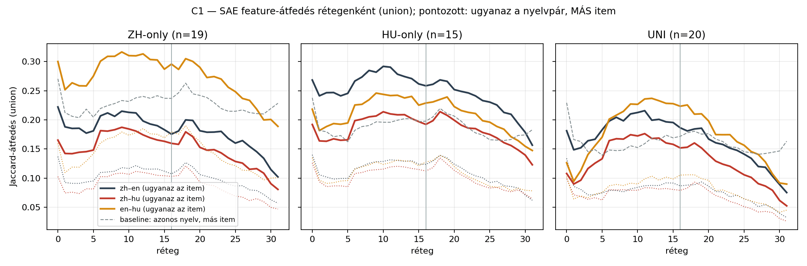
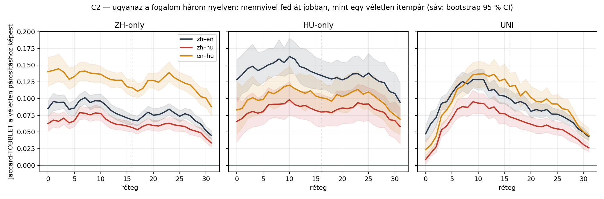
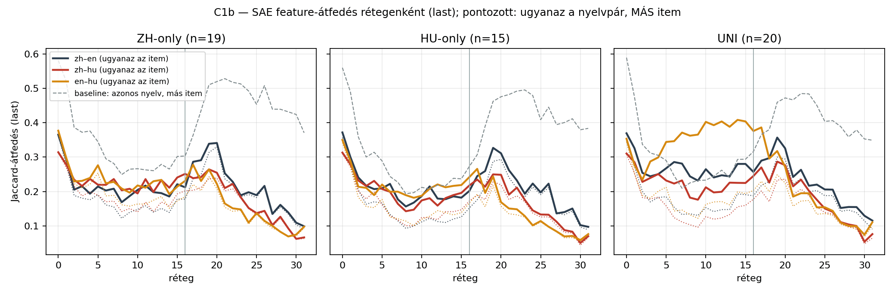

# Mérés C — SAE feature-átfedés a nyelvek között

258 prompt × 32 réteg × 50 aktív feature · modell: **Qwen3.5-9B-Base** · token-tartomány: **question**.

⛔ A mérés **kizárólag a kérdés tokenjeit** használja, a prompt keretét nem. A base körben a keret a `Kérdés: ` / `
Válasz:` címke (a prompt-tokenek 31 %-a), az instruct körben a chat-sablon burkolata (45 %) — és a keret nyelven belül, az instructnál pedig NYELVEK KÖZT IS bitre azonos, tehát önmagában felnyomná az átfedést. A szűkítés a hatást nem gyengíti, hanem **élesíti**: a base kör UNI zh–en csúcstöbblete a teljes prompton +0,090 volt, a kérdésre szűkítve **+0,129** — a közös keret a VÉLETLEN párosítást emelte jobban, azaz hígította a jelet.

Két halmaz: `last` (a kérdés utolsó tokene) és `union` (a kérdés minden tokenének uniója). Minden állítás a baseline-hoz mért **többletről** szól.

## Permutációs teszt az előre rögzített 16. rétegen (`union`)

| csoport | nyelvpár | ugyanaz az item | véletlen párosítás | p (nyers) | p (Holm) |
|---|---|---|---|---|---|
| ZH | zh-en | **0.176** | 0.108 | 0.0010 | 0.0090 ✅ |
| ZH | zh-hu | **0.160** | 0.103 | 0.0010 | 0.0090 ✅ |
| ZH | en-hu | **0.296** | 0.179 | 0.0010 | 0.0090 ✅ |
| HU | zh-en | **0.259** | 0.124 | 0.0010 | 0.0090 ✅ |
| HU | zh-hu | **0.192** | 0.113 | 0.0010 | 0.0090 ✅ |
| HU | en-hu | **0.229** | 0.128 | 0.0010 | 0.0090 ✅ |
| UNI | zh-en | **0.186** | 0.087 | 0.0010 | 0.0090 ✅ |
| UNI | zh-hu | **0.152** | 0.079 | 0.0010 | 0.0090 ✅ |
| UNI | en-hu | **0.223** | 0.105 | 0.0010 | 0.0090 ✅ |

## Rétegenkénti átfedés és többlet (`union`)

| csoport | nyelvpár | 8. | 16. | 24. | 31. | max. többlet (réteg) |
|---|---|---|---|---|---|---|
| ZH | zh–en | 0.206 (+0.094) | 0.176 (+0.068) | 0.168 (+0.079) | 0.102 (+0.045) | **+0.101** (7.) |
| ZH | zh–hu | 0.183 (+0.076) | 0.160 (+0.057) | 0.135 (+0.061) | 0.081 (+0.034) | **+0.079** (6.) |
| ZH | en–hu | 0.309 (+0.138) | 0.296 (+0.116) | 0.256 (+0.131) | 0.189 (+0.088) | **+0.145** (2.) |
| HU | zh–en | 0.285 (+0.159) | 0.259 (+0.135) | 0.233 (+0.132) | 0.157 (+0.095) | **+0.163** (10.) |
| HU | zh–hu | 0.205 (+0.092) | 0.192 (+0.080) | 0.178 (+0.092) | 0.123 (+0.058) | **+0.098** (10.) |
| HU | en–hu | 0.235 (+0.112) | 0.229 (+0.101) | 0.199 (+0.107) | 0.147 (+0.069) | **+0.120** (10.) |
| UNI | zh–en | 0.198 (+0.122) | 0.186 (+0.100) | 0.148 (+0.077) | 0.075 (+0.043) | **+0.129** (11.) |
| UNI | zh–hu | 0.167 (+0.087) | 0.152 (+0.073) | 0.113 (+0.056) | 0.053 (+0.026) | **+0.095** (9.) |
| UNI | en–hu | 0.215 (+0.127) | 0.223 (+0.118) | 0.162 (+0.092) | 0.090 (+0.045) | **+0.137** (11.) |

## A többlet alakja rétegenként — ez a mérés lényege

| csoport | nyelvpár | többlet a 0–2. rétegen | csúcs (réteg) | az utolsó rétegen |
|---|---|---|---|---|
| ZH | zh–en | +0.092 | **+0.101** (7.) | +0.045 |
| ZH | zh–hu | +0.065 | **+0.079** (6.) | +0.034 |
| ZH | en–hu | +0.142 | **+0.145** (2.) | +0.088 |
| HU | zh–en | +0.136 | **+0.163** (10.) | +0.095 |
| HU | zh–hu | +0.071 | **+0.098** (10.) | +0.058 |
| HU | en–hu | +0.089 | **+0.120** (10.) | +0.069 |
| UNI | zh–en | +0.061 | **+0.129** (11.) | +0.043 |
| UNI | zh–hu | +0.018 | **+0.095** (9.) | +0.026 |
| UNI | en–hu | +0.033 | **+0.137** (11.) | +0.045 |

## ⛔⛔ Kontroll — nem a szó szerinti token-egyezés csinálja?

A korpusz kérdései átírást ÉS eredeti írásjegyet is tartalmaznak (*„Melyik tartományban tisztelik elsősorban **Fazhugong (法主公)** népi istenséget?”*), tehát a magyar prompt szó szerint tartalmazza a kínai sztringet. Ha a feature-többletet ez okozná, a „közös fogalmi tér” állítás megdőlne. Három ellenőrzés:

| csoport | nyelvpár | token-Jaccard (átlag) | Spearman(token-átfedés, feature-többlet) | feature-többlet — mind | …a KIS token-átfedésű felén |
|---|---|---|---|---|---|
| ZH | zh–en | 0.108 | +0.22 | +0.068 | +0.067 (n=11) |
| ZH | zh–hu | 0.083 | +0.23 | +0.057 | +0.054 (n=10) |
| ZH | en–hu | 0.240 | +0.24 | +0.116 | +0.107 (n=11) |
| HU | zh–en | 0.115 | +0.86 | +0.135 | +0.108 (n=9) |
| HU | zh–hu | 0.081 | +0.59 | +0.080 | +0.048 (n=8) |
| HU | en–hu | 0.159 | +0.69 | +0.101 | +0.069 (n=8) |
| UNI | zh–en | 0.040 | +0.37 | +0.100 | +0.092 (n=12) |
| UNI | zh–hu | 0.029 | -0.15 | +0.073 | +0.071 (n=11) |
| UNI | en–hu | 0.102 | +0.08 | +0.118 | +0.123 (n=10) |

Továbbá a `last` halmaz — a kérdés-tartomány UTOLSÓ tokene, vagyis a kérdés záró `?` / `？` írásjegye —: ezen a pozíción szó szerinti tartalmi egyezés nincs, csak a figyelemmel odajutott kontextus (ami a teljes kérdést összegzi, tehát a literális átfedést nem zárja ki teljesen):

| csoport | nyelvpár | ugyanaz az item (`last`) | véletlen párosítás | p (nyers) |
|---|---|---|---|---|
| ZH | zh-en | **0.212** | 0.177 | 0.0010 |
| ZH | zh-hu | **0.251** | 0.202 | 0.0010 |
| ZH | en-hu | **0.231** | 0.185 | 0.0010 |
| HU | zh-en | **0.201** | 0.152 | 0.0010 |
| HU | zh-hu | **0.217** | 0.172 | 0.0010 |
| HU | en-hu | **0.242** | 0.166 | 0.0010 |
| UNI | zh-en | **0.257** | 0.187 | 0.0010 |
| UNI | zh-hu | **0.245** | 0.178 | 0.0010 |
| UNI | en-hu | **0.376** | 0.203 | 0.0010 |

## Kvalitatív — háromnyelvű, ritka feature-ök

A 8. rétegen (a többlet-csúcsok átlaga) azok a feature-ök, amelyek ugyanarra az itemre MINDHÁROM nyelven aktívak, de a promptok legfeljebb 20 %-án tüzelnek (a gyakoriak a sablon- és nyelv-feature-ök). Összesen **2619** ilyen (feature, item) pár. Az alábbiak ráadásul HÁROM KÜLÖNBÖZŐ sztringen tüzelnek a három nyelven (**1166** ilyen) — itt tehát nem a token közös, hanem a fogalom:

| item | feature | hány promptban aktív (258-ból) | mely tokeneken tüzel — kínai / angol / magyar |
|---|---|---|---|
| HU01 (HU) | 32341 | 3 | `场合` / `occasion` / `hoz ik` |
| HU03 (HU) | 31343 | 3 | `命` / `to  do  on ?` / `kellett` |
| HU03 (HU) | 33443 | 3 | `奉 之 命` / `did  disguised  King  have  to  of` / `ut as ítás ára` |
| HU03 (HU) | 18214 | 3 | `命` / `orders  of ?` / `ára` |
| HU03 (HU) | 25936 | 3 | `法官` / `judge  of` / `bí ró` |
| HU03 (HU) | 8032 | 3 | `装的` / `disguised` / `ruh ában` |

## Mit mond ez a hipotézisről?

⭐⭐ **A H1 által jósolt alak megjelenik — és a legtisztábban a UNI-csoportban.** Ott a három nyelvi változat felszíni alakja tényleg különbözik (`fotoszintézis` / `photosynthesis` / `光合作用`), tehát szó szerinti token-egyezés alig van: a többlet az embedding környékén még csak **+0.037**, a **9–11. rétegen +0.120** a csúcs, a kimenet felé pedig **+0.038**-ra esik vissza. Vagyis: a nyelvek a bemeneten szétváltak, a középső rétegekben közelednek, a végén újra elválnak — pontosan a „nem fordít, de nem is végig nyelvfüggetlen” kép.

⭐ **Ez az a mérés, amit a logit lens nem tudott elvégezni.** A Mérés B kiderítette, hogy a naiv lens a 0–23. rétegen olvashatatlan; az SAE viszont épp ott, a 7–11. rétegen mutatja a legerősebb nyelvek közti közeledést. A két mérés így nem átfed, hanem kiegészíti egymást.

⛔ **Amit NEM mond:** a többlet abszolút értéke kicsi (a Jaccard 0,19-ről 0,13-ra esne vissza véletlen párosításnál), tehát a reprezentáció **túlnyomó része nyelvspecifikus marad** — a közös fogalmi rész egy réteg a nyelvi jelek tetején, nem a fő jel. És a mérés nem mondja meg, hogy a közös rész ANGOL-e; ahhoz a Mérés D (lefordíthatatlan fogalmak) kell.

⛔ **Korlát:** a ZH- és HU-csoportban a kérdések átírást és eredeti írásjegyet is tartalmaznak, ezért ott a korai rétegek többlete részben szó szerinti token-egyezés (a kontroll-táblában a HU csoport Spearman-értéke +0,59…+0,86). A UNI-csoport ettől mentes — az érvet arra kell építeni.

