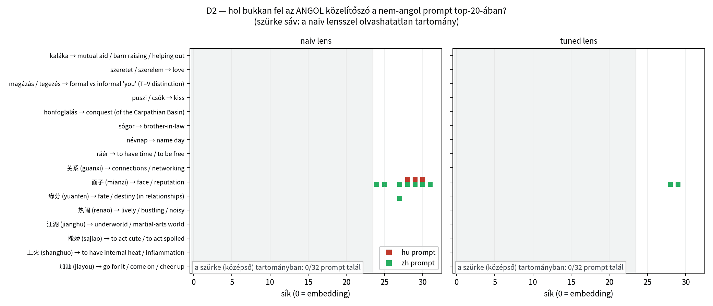
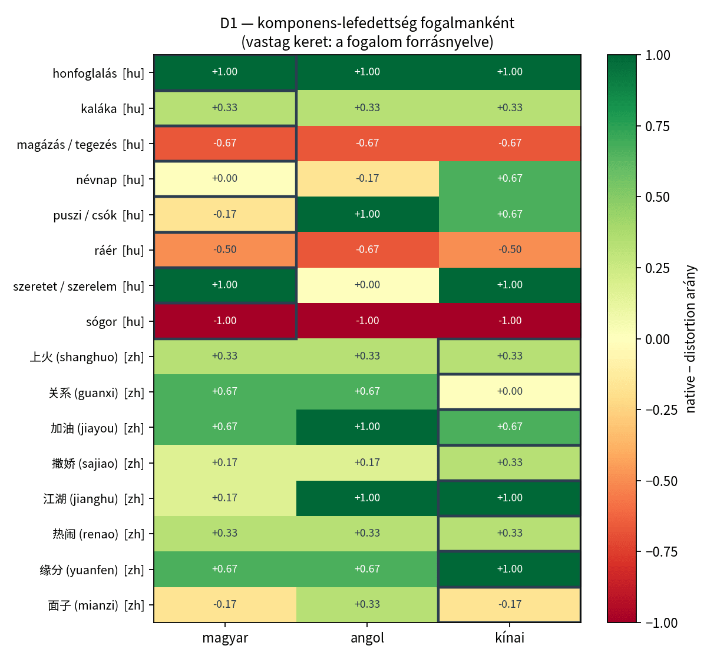

# Mérés D — lefordíthatatlan fogalmak (a fordítási hipotézis direkt tesztje)

16 fogalom × 3 nyelv + 16 kontrollszó × 3 nyelv. A `native` és `distortion` komponenseket a bíráló komponensenként külön értékelte; a `manual_*` oszlop a saját ellenőrző körömé (runbook §4b: mind a 48 kötelező) — ebben a futásban **96 cella** ellenőrző felülírás.

## D1 — komponens-lefedettség

| forrásnyelv | prompt nyelve | native | distortion | hurokba esett |
|---|---|---|---|---|
| hu (8 fogalom) | hu ← **forrásnyelv** | 8/22 = **36%** [20%–57%] | 6/16 = 38% | 1/8 |
| hu (8 fogalom) | en | 10/22 = **45%** [27%–65%] | 7/16 = 44% | 0/8 |
| hu (8 fogalom) | zh | 11/22 = **50%** [31%–69%] | 5/16 = 31% | 4/8 |
| zh (8 fogalom) | hu | 13/24 = **54%** [35%–72%] | 3/16 = 19% | 2/8 |
| zh (8 fogalom) | en | 15/24 = **62%** [43%–79%] | 1/16 = 6% | 1/8 |
| zh (8 fogalom) | zh ← **forrásnyelv** | 12/24 = **50%** [31%–69%] | 1/16 = 6% | 0/8 |

### Párosított összevetés — forrásnyelv vs. angol (fogalmanként, előjelteszt)

- **hu-forrású fogalmak (n=8):** a forrásnyelv 1 fogalomnál jobb, 3-nél rosszabb az angolnál (előjelteszt p = 0.625) — átlagos különbség -0.25 komponens.
- **zh-forrású fogalmak (n=8):** a forrásnyelv 1 fogalomnál jobb, 3-nél rosszabb az angolnál (előjelteszt p = 0.625) — átlagos különbség -0.38 komponens.

## D1 kontroll — a hétköznapi szavak definíciója

Ha a nyelvek közti különbség a kontrollszavaknál IS megvan, akkor nem a lefordíthatatlanságból jön, hanem a modell általános nyelvi teljesítményéből.

| prompt nyelve | jó | részben | rossz | hurokba esett |
|---|---|---|---|---|
| hu | 7 | 5 | 4 | 5/16 |
| en | 14 | 2 | 0 | 1/16 |
| zh | 11 | 4 | 1 | 4/16 |

⛔⛔ **A kontroll fog: a magyar általánosan gyengébb** — hétköznapi szóra is csak 44% a jó definíció, szemben az angol 88%-kal (kínai 69%). A D1 nyelvek közti különbségét tehát **nem szabad** a lefordíthatatlanságnak tulajdonítani: a különbség jó része a generálás általános minőségéből jön.

## ⛔⛔ Keretezési érzékenységvizsgálat

A fagyasztott korpuszban a kínai-forrású fogalmak kérdése **nyelvenként más keretet ad**: a magyar/angol változat „fogalom”/„concept” magyarázatot kér, a kínai viszont `一词` („a szó”) — sima szótári kérdést. Ez önmagában megmagyarázhatja, miért ad a modell kínaiul általános glosszát. Ezért a 8 kínai-forrású fogalomra lefutott egy extra generálás **szimmetrizált** kínai kérdéssel (`一词` → `这个概念`).

| fogalom | eredeti kínai kérdés (一词) | szimmetrizált (这个概念) |
|---|---|---|
| 关系 (guanxi) | 0/3 | **0/3** |
| 面子 (mianzi) | 1/3 | **3/3** |
| 缘分 (yuanfen) | 3/3 | **2/3** |
| 热闹 (renao) | 1/3 | **3/3** |
| 江湖 (jianghu) | 3/3 | **3/3** |
| 撒娇 (sajiao) | 1/3 | **1/3** |
| 上火 (shanghuo) | 1/3 | **2/3** |
| 加油 (jiayou) | 2/3 | **2/3** |

Átlagos változás: **+0.50 komponens** (javult 3, romlott 1, előjelteszt p = 0.625).

## ⛔⛔ Az önértékelő toldalék — egy nyelvfüggő mérési hiba, ami majdnem eldöntötte a D1-et

A base modell a válasz után gyakran **saját feladat-promptot** ír (*„请判断回答是否正确…正确”*, *„A single-select problem: Is the question answered…”*), és ez a bírálót félrevezeti: egy mért esetben (撒娇/zh) a bíráló a toldalékra ítélt („a válasz csak a »helyes« szót tartalmazza”), és 0 komponenst adott egy olyan válaszra, amiben az első komponens egyértelműen benne van.

A jelenség **nyelvfüggő**: hu 0/86 = 0% · en 3/86 = 3% · zh 13/86 = 15% — tehát pont azokat a cellákat rontja, ahol a D1 meglepő eredménye született.

A `src/clean_answers.py` utólag levágja (generálni nem kell újra, a toldalék nem része a válasznak), és a bírálók a `text_clean` mezőt kapják. **A javítás hatása mérve:** a kínai-forrású fogalmak kínai nyelvű komponens-lefedettsége **58 % → 71 %**, a Mérés A `HU/en` cellája pedig 27 % → 20 % (ott a toldalék *fel*felé torzított). Ezt a lépést a módszertanban le kell írni.

## D3 — SAE: a fogalom vagy az angol közelítőszó felé húz?

A 10. rétegen (a Mérés C többlet-csúcsa), `union` halmazon. Három Jaccard fogalmanként:

| fogalom | forrás | J(forrás, saját angol kérdés) | J(forrás, angol KÖZELÍTŐSZÓ) | J(forrás, harmadik nyelv) |
|---|---|---|---|---|
| kaláka | hu | **0.271** | 0.182 | 0.301 |
| szeretet / szerelem | hu | **0.278** | 0.176 | 0.297 |
| magázás / tegezés | hu | **0.270** | 0.174 | 0.316 |
| puszi / csók | hu | **0.291** | 0.175 | 0.293 |
| honfoglalás | hu | **0.282** | 0.181 | 0.292 |
| sógor | hu | **0.220** | 0.161 | 0.200 |
| névnap | hu | **0.229** | 0.140 | 0.237 |
| ráér | hu | **0.253** | 0.165 | 0.232 |
| 关系 (guanxi) | zh | **0.237** | 0.218 | 0.214 |
| 面子 (mianzi) | zh | **0.254** | 0.207 | 0.221 |
| 缘分 (yuanfen) | zh | **0.249** | 0.210 | 0.220 |
| 热闹 (renao) | zh | **0.250** | 0.231 | 0.224 |
| 江湖 (jianghu) | zh | **0.246** | 0.211 | 0.220 |
| 撒娇 (sajiao) | zh | **0.255** | 0.211 | 0.216 |
| 上火 (shanghuo) | zh | **0.233** | 0.193 | 0.198 |
| 加油 (jiayou) | zh | **0.253** | 0.219 | 0.232 |

### D3b — a konfundálás-mentes változat (⛔ KONTROLLSZAVAS: ld. lent)

⛔⛔ **2026-08-26, bírálat nyomán:** ez a szakasz a fogalomhoz rendelt KONTROLLSZÓ (`control.en`: help, friendship…) promptját hasonlítja, NEM az `en_approx` közelítőszóét (mutual aid, love…) — tehát „szemantikai szomszéd”-tesztként olvasandó, a fordítási hipotézis tesztje az újramérés: `05_d3b_ujrameres.md` (`analyze_d3b.py`, protokoll: `d3b-protokoll.md`).

⛔⛔ A fenti tábla **nem tiszta**: a fogalom saját angol kérdése szó szerint tartalmazza magát a fogalmat (*„What does the Chinese concept '关系' (guanxi) mean?”*), az angol közelítőszó-prompt viszont nem — a magasabb Jaccard jöhet puszta token-egyezésből is. Tiszta kérdés: a forrásnyelvi fogalom közelebb van-e a **saját** angol közelítőszavához, mint **más fogalmak** angol közelítőszavaihoz? Itt egyik oldalon sincs szó szerinti egyezés.

| fogalom | J(forrás, SAJÁT angol közelítőszó) | J(forrás, MÁS fogalmak közelítőszavai, átlag) | többlet |
|---|---|---|---|
| kaláka | 0.182 | 0.188 | **-0.006** |
| szeretet / szerelem | 0.176 | 0.164 | **+0.012** |
| magázás / tegezés | 0.174 | 0.166 | **+0.008** |
| puszi / csók | 0.175 | 0.157 | **+0.018** |
| honfoglalás | 0.181 | 0.183 | **-0.002** |
| sógor | 0.161 | 0.150 | **+0.011** |
| névnap | 0.140 | 0.132 | **+0.008** |
| ráér | 0.165 | 0.158 | **+0.007** |
| 关系 (guanxi) | 0.218 | 0.215 | **+0.003** |
| 面子 (mianzi) | 0.207 | 0.208 | **-0.001** |
| 缘分 (yuanfen) | 0.210 | 0.216 | **-0.006** |
| 热闹 (renao) | 0.231 | 0.219 | **+0.011** |
| 江湖 (jianghu) | 0.211 | 0.211 | **-0.000** |
| 撒娇 (sajiao) | 0.211 | 0.212 | **-0.001** |
| 上火 (shanghuo) | 0.193 | 0.206 | **-0.013** |
| 加油 (jiayou) | 0.219 | 0.200 | **+0.019** |

Átlagos többlet: **+0.0043** — 9 fogalomnál pozitív, 7-nél negatív (előjelteszt p = 0.804).

⭐⭐ **Nincs kimutatható vonzás a saját angol közelítőszó felé** — a fogalom forrásnyelvi reprezentációja nem áll közelebb a szegényebb angol megfelelőjéhez, mint bármelyik másikhoz. Ez a legtisztább jel a **fordítás-hipotézis ellen**: nem látszik, hogy a modell az angol közelítésen keresztül érné el a fogalmat.

**Átlag:** saját angol kérdés 0.254 · angol közelítőszó 0.191 · harmadik nyelv 0.245.
A forrásnyelvi fogalom 16 esetben a SAJÁT angol kérdéséhez áll közelebb, 0 esetben az angol közelítőszóhoz (előjelteszt p = 0.000).

⭐ **A fogalom a saját fordításához húz, nem a szegényebb angol közelítéshez** — ez a fordítás-hipotézis ellen szól: a modell nem az angol közelítőszón keresztül éri el a fogalmat.

## D2 — logit lens: megjelenik-e az angol közelítés?

⛔ A Mérés B kimutatta, hogy a **naiv** logit lens a 0–23. síkon olvashatatlan ezen a modellen (a top-20 76%-a nem szó), ezért az eredeti kérdés („felbukkan-e a »noisy« a 15–25. rétegben?”) vele **nem tesztelhető** — csak a 24–31. sík.

⚠️ A **tuned lens** ezt a tartományt olvashatóvá tette (nem-szó arány 76% → 31%), tehát a kérdés most tesztelhető. **De:** a fordítót a végső eloszlás KL-jére tanítottuk, ezért előrehúzhat olyan tokent, ami a rétegben még nincs ott (ld. `03_meres_b_tuned.md` — a várt válasz mediánrangja már a 0. síkon 100 alá esik). A tuned oszlop tehát **felső korlát**, a naiv oszlop **alsó korlát**.

| fogalom | angol közelítés | naiv, 24–31. sík | tuned, első sík | tuned, hány síkon |
|---|---|---|---|---|
| kaláka | mutual aid / barn raising / helping out | – | – | – |
| szeretet / szerelem | love | – | – | – |
| magázás / tegezés | formal vs informal 'you' (T–V distinction) | – | – | – |
| puszi / csók | kiss | – | – | – |
| honfoglalás | conquest (of the Carpathian Basin) | – | – | – |
| sógor | brother-in-law | – | – | – |
| névnap | name day | – | – | – |
| ráér | to have time / to be free | – | – | – |
| 关系 (guanxi) | connections / networking | – | – | – |
| 面子 (mianzi) | face / reputation | hu: face; zh: face | zh: 28 | 2 |
| 缘分 (yuanfen) | fate / destiny (in relationships) | zh: fate | – | – |
| 热闹 (renao) | lively / bustling / noisy | – | – | – |
| 江湖 (jianghu) | underworld / martial-arts world | – | – | – |
| 撒娇 (sajiao) | to act cute / to act spoiled | – | – | – |
| 上火 (shanghuo) | to have internal heat / inflammation | – | – | – |
| 加油 (jiayou) | go for it / come on / cheer up | – | – | – |

**2/16 fogalomnál** bukkan fel az angol közelítés valamelyik szava a nem-angol prompt KÉSŐI rétegeiben a naiv lensszel; a tuned lensszel — bármelyik síkon — **1/16**.

⭐⭐ **A KÖZÉPSŐ (0–23.) síkon egyetlen találat sincs: 0/32 prompt a naiv, 0/32 a tuned lensszel.** Épp ez volt a fordítási hipotézis legdirektebb tesztje — a Mérés B óta tudjuk, hogy a naiv lens itt vak, de a tuned lens **látja** ezt a tartományt (a 0–23. sík átlagos nem-szó aránya 76% → 31%), és **ott sem** hozza elő az angol közelítőszót. A talált néhány eset mind a 24. sík FÖLÖTT van, tehát abban a tartományban, ahol a modell már a válasz nyelve felé fordul.

⚠️ Ellenpróba-korlát: a tuned lens top-20-a **koncentráltabb** (3367 vs. 9064 különböző token az egész korpuszon), tehát kevesebb szót lát — a 0 találat részben ebből is jöhet. A naiv lens 0-ja viszont nem ilyen: az ő top-20-a tágabb, csak épp olvashatatlan.

⛔⛔ **A null-eredmény bizonyító ereje korlátos** — ld. a kör kontroll-riportját ([05_d2_kontroll.md](05_d2_kontroll.md), `src/d2_control.py`): az ANGOL prompton futó pozitív kontroll szerint a műszer érzékenysége alacsony, több fogalom jelöltszava a korpusz egyetlen top-20-jában sem fordul elő, és a szóillesztés írásjel-érzékeny (tisztított matcherrel a nulla törhet). A D2 tehát gyenge evidencia a fordítási útvonal ellen, nem perdöntő.

## A Mérés D ítélete a fordítási hipotézisről

A runbook három jóslatot fogalmazott meg. A mérés a **köztes** képhez áll legközelebb, de a „fordítás angolon keresztül” változatot két független jel is cáfolja:

1. ⭐⭐ **D3b (a konfundálás-mentes SAE-teszt): nincs vonzás az angol közelítőszó felé.** A forrásnyelvi fogalom nem áll közelebb a saját angol közelítéséhez (0.191), mint más fogalmak közelítőszavaihoz — az átlagos többlet +0.0043 (előjelteszt p = 0.80). Ha a modell az angol közelítésen keresztül érné el a fogalmat, itt pozitív, szignifikáns többletnek kellene lennie.
2. ⭐⭐ **D2: a KÖZÉPSŐ (0–23.) síkon 0/32 prompt találja meg az angol közelítőszót — és a tuned lensszel is 0/32.** A naiv lens ebben a tartományban vak (Mérés B), de a tuned lens LÁTJA (nem-szó arány 31%), és ott sem hozza elő. A mindössze 2/16 találat a **24. sík fölött** van, tehát ott, ahol a modell már a válasz nyelve felé fordul. Ez a fordítási hipotézis legdirektebb tesztje, és megbukik rajta.
3. ⚠️ **D1: a viselkedés szintjén az angol a legjobb** mindkét forrásnyelvnél (hu-forrás: hu 36% vs en 45%; zh-forrás: zh 50% vs en 62%) — **de ez a jel három konfundálóval terhelt**: (a) a kontroll szerint a magyar generálás általánosan gyengébb, (b) a kínai kérdés más keretet ad („一词” = szó, nem fogalom), (c) az önértékelő toldalék nyelvfüggően rontotta a bírálatot.

**Összefoglalva:** a *reprezentáció* szintjén nincs nyoma annak, hogy a modell az angol közelítésen keresztül érné el a lefordíthatatlan fogalmakat; a *viselkedés* szintjén viszont az angol válasz a leggazdagabb — de ezt a különbséget nagyrészt a nyelvi generálás minősége és a kérdés keretezése magyarázza, nem a fogalom hozzáférési útja.

⛔ **Korlát:** 8+8 fogalom, a `native`/`distortion` listákat én definiáltam, a kontrollszó-párosítás nem tökéletes. Ez kvalitatív-illusztratív mérés; a számszerű alapot a Mérés C adja.

