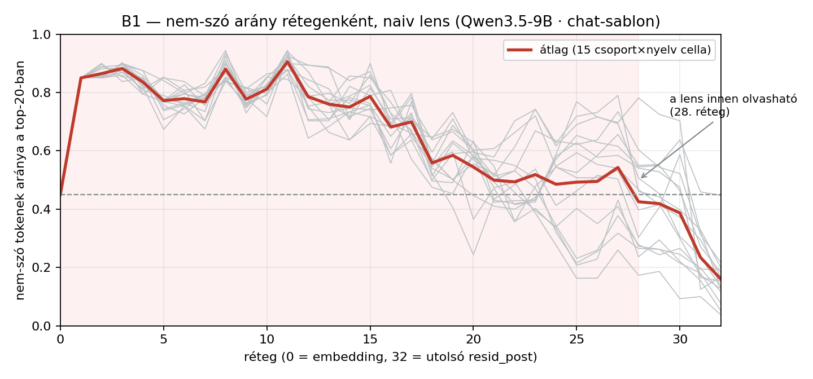
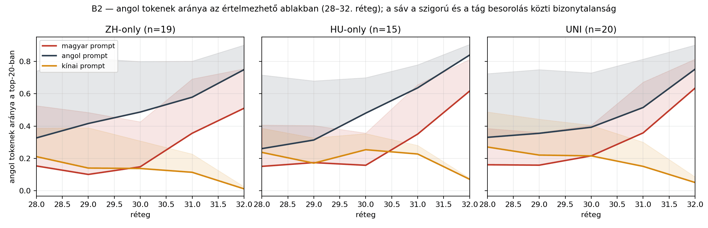
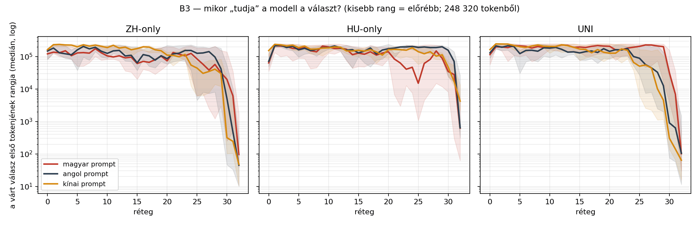

# Mérés B — logit lens (naiv)

258 prompt utolsó prompt-tokene, 33 sík, top-20 token rétegenként. Osztályozó: hunspell hu_HU + american-english.

## B1 — ⛔ a naiv logit lens ezen a modellen csak késői rétegeken értelmezhető

A top-20 token **69%-a nem szó** a 0–27. rétegen (`'��'`, `'GenerationStrategy'`, `'.SizeType'`), és csak a **28. rétegtől** esik 45% alá. Ez ismert jelenség — épp ezért készült a tuned lens (Belrose et al. 2023): a köztes residual nem esik egybe az unembedding terével.

**Következmény a hipotézisre:** a H1 „középső rétegekben közös, angol felé torzított tér” állítása ezzel az eszközzel **nem tesztelhető** — a középső rétegek kimenete nem olvasható. Amit mérni tudunk: a késői rétegek nyelvi dinamikája (B2) és a válasz megjelenésének mélysége (B3). A középső rétegekre az **SAE (Mérés C)** ad választ, ami nem az unembeddingre vetít.

## B2 — angol tokenek aránya a 28–32. rétegen

| csoport/nyelv | 28. | 30. | 32. |
|---|---|---|---|
| ZH/hu | 15% | 15% | 51% |
| ZH/en | 33% | 49% | 75% |
| ZH/zh | 21% | 14% | 1% |
| HU/hu | 15% | 16% | 62% |
| HU/en | 26% | 48% | 84% |
| HU/zh | 24% | 25% | 7% |
| UNI/hu | 16% | 22% | 64% |
| UNI/en | 33% | 39% | 75% |
| UNI/zh | 27% | 22% | 5% |

## B3 — mikor jelenik meg a válasz? (a várt válasz első tokenjének mediánrangja)

| csoport/nyelv | n | 20. | 24. | 28. | 30. | 32. | rang<100 innen | rang<10 innen |
|---|---|---|---|---|---|---|---|---|
| ZH/hu | 19 | 73,797 | 125,191 | 57,080 | 19,792 | 96 | 32 | – |
| ZH/en | 19 | 86,053 | 153,932 | 96,804 | 5,127 | 45 | 32 | – |
| ZH/zh | 19 | 110,420 | 54,468 | 40,987 | 316 | 48 | 32 | – |
| HU/hu | 15 | 141,034 | 46,834 | 148,866 | 34,699 | 621 | – | – |
| HU/en | 15 | 174,316 | 205,521 | 189,489 | 156,549 | 639 | – | – |
| HU/zh | 15 | 163,083 | 186,155 | 103,174 | 47,357 | 4,229 | – | – |
| UNI/hu | 20 | 207,527 | 193,994 | 212,258 | 31,480 | 102 | – | – |
| UNI/en | 20 | 144,479 | 100,345 | 32,909 | 902 | 105 | – | – |
| UNI/zh | 20 | 127,146 | 66,002 | 10,162 | 304 | 64 | 32 | – |

## Mit mond ez a hipotézisről?

- **ZH**: a válasz mediánrangja 100 alá kerül — magyar prompt: a 32. rétegtől · angol prompt: a 32. rétegtől · kínai prompt: a 32. rétegtől
- **HU**: a válasz mediánrangja 100 alá kerül — magyar prompt: soha · angol prompt: soha · kínai prompt: soha
- **UNI**: a válasz mediánrangja 100 alá kerül — magyar prompt: soha · angol prompt: soha · kínai prompt: a 32. rétegtől

⚠️ **Ebben a körben a rang-görbe nem hasonlítható a base köréhez:** a válasz mediánrangja több cellában sehol nem esik 100 alá (ld. a fenti listát). Chat-sablonos promptnál az utolsó prompt-token a sablon burkolatának tokenje, nem a kérdésé, ezért a válasz-mélység itt nem ugyanazt méri — az összevetést a base kör naiv riportjára kell alapozni.

## Az osztályozó megbízhatósága

100 véletlen token kétszeres értékelése: **92 % egyetértés** ([03_classifier_ellenorzes.md](../reports/03_classifier_ellenorzes.md)). Mind a 8 hiba rövid latin töredék vagy tulajdonnév (pl. a magyar „Mirr-Murr” `Mir` töredéke angolnak számítana). A CJK-felismerés hibátlan. Ezért a B2 görbét csak a bizonytalansági sávval együtt szabad olvasni.

