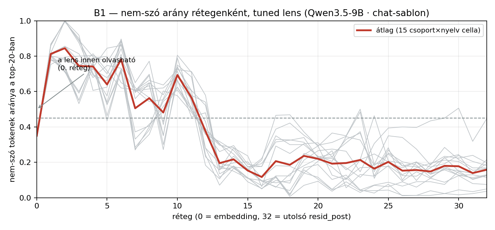
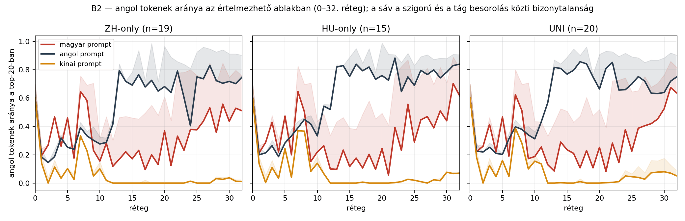
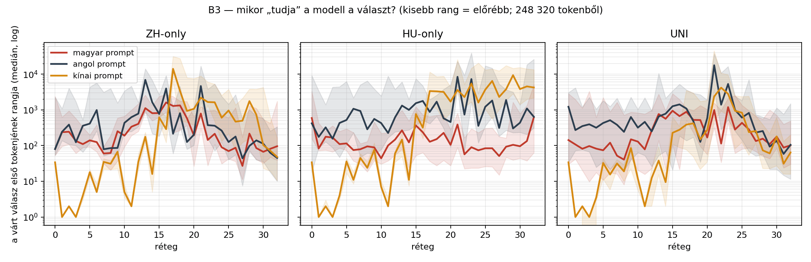

# Mérés B — logit lens (tuned)

258 prompt utolsó prompt-tokene, 33 sík, top-20 token rétegenként. Osztályozó: hunspell hu_HU + american-english.

## B1 — a tuned lens a középső síkokat is olvashatóvá teszi

A középső (0–23.) síkok átlagos nem-szó aránya **43%** (a naiv lens 72%-ával szemben); a 45%-os küszöböt ebből a tartományból 11 sík lépi át. A javulás ebben a körben csak részleges: a küszöb fölötti síkok miatt a B2 görbéit a középső tartományban is csak óvatosan, irányjelzésként szabad olvasni.

⛔⛔ **Cserébe a fordító visszaszivárogtat:** a rétegenkénti fordítók a VÉGSŐ eloszlás KL-jére tanultak, tehát részben elvégzik a hátralévő számítást. A B3 válasz-rang görbe erről a lensről NEM a modell tudás-mélységét méri — azt a naiv lens riportjából (`03_meres_b.md`) kell olvasni.

## B2 — angol tokenek aránya a 0–32. rétegen

| csoport/nyelv | 0. | 2. | 4. | 6. | 8. | 10. | 12. | 14. | 16. | 18. | 20. | 22. | 24. | 26. | 28. | 30. | 32. |
|---|---|---|---|---|---|---|---|---|---|---|---|---|---|---|---|---|---|
| ZH/hu | 60% | 27% | 26% | 18% | 58% | 16% | 12% | 22% | 23% | 20% | 37% | 33% | 38% | 44% | 36% | 44% | 51% |
| ZH/en | 60% | 14% | 32% | 24% | 33% | 28% | 42% | 72% | 77% | 73% | 68% | 79% | 41% | 74% | 72% | 72% | 75% |
| ZH/zh | 60% | 0% | 3% | 3% | 23% | 10% | 0% | 0% | 0% | 0% | 0% | 0% | 1% | 0% | 3% | 4% | 1% |
| HU/hu | 60% | 29% | 22% | 20% | 50% | 22% | 10% | 23% | 18% | 20% | 24% | 39% | 56% | 45% | 39% | 44% | 62% |
| HU/en | 60% | 21% | 19% | 33% | 45% | 33% | 52% | 83% | 84% | 82% | 76% | 88% | 75% | 80% | 80% | 78% | 84% |
| HU/zh | 60% | 0% | 3% | 4% | 37% | 14% | 0% | 0% | 0% | 0% | 0% | 0% | 3% | 1% | 2% | 8% | 7% |
| UNI/hu | 60% | 26% | 22% | 19% | 51% | 19% | 13% | 29% | 21% | 23% | 25% | 28% | 38% | 39% | 42% | 52% | 64% |
| UNI/en | 60% | 22% | 21% | 31% | 38% | 31% | 57% | 81% | 80% | 84% | 66% | 85% | 66% | 75% | 64% | 64% | 75% |
| UNI/zh | 60% | 0% | 4% | 5% | 28% | 16% | 0% | 0% | 0% | 0% | 0% | 0% | 5% | 4% | 7% | 8% | 5% |

## B3 — mikor jelenik meg a válasz? (a várt válasz első tokenjének mediánrangja)

| csoport/nyelv | n | 20. | 24. | 28. | 30. | 32. | rang<100 innen | rang<10 innen |
|---|---|---|---|---|---|---|---|---|
| ZH/hu | 19 | 193 | 90 | 216 | 67 | 96 | – | – |
| ZH/en | 19 | 201 | 263 | 98 | 113 | 45 | – | – |
| ZH/zh | 19 | 1,068 | 603 | 1,754 | 103 | 48 | – | 1 |
| HU/hu | 15 | 105 | 74 | 93 | 96 | 621 | 1 | – |
| HU/en | 15 | 457 | 357 | 1,889 | 436 | 639 | – | – |
| HU/zh | 15 | 1,706 | 1,603 | 3,780 | 3,828 | 4,229 | – | 1 |
| UNI/hu | 20 | 168 | 282 | 156 | 178 | 102 | 2 | – |
| UNI/en | 20 | 587 | 997 | 256 | 137 | 105 | 29 | – |
| UNI/zh | 20 | 275 | 940 | 74 | 180 | 64 | – | 1 |

## Mit mond ez a hipotézisről?

- **ZH**: a válasz mediánrangja 100 alá kerül — magyar prompt: soha · angol prompt: soha · kínai prompt: soha
- **HU**: a válasz mediánrangja 100 alá kerül — magyar prompt: a 1. rétegtől · angol prompt: soha · kínai prompt: soha
- **UNI**: a válasz mediánrangja 100 alá kerül — magyar prompt: a 2. rétegtől · angol prompt: a 29. rétegtől · kínai prompt: soha

⛔⛔ **A fenti rang-táblát és réteg-listát erről a lensről TILOS a modell tudásaként olvasni.** A tanult fordító a késői rétegek kimenetét jósolja, tehát a választ „előrehúzza”: a rang már a korai síkokon alacsony ott is, ahol a modell a választ sosem találja el. A válasz-mélység érvényes mérése a NAIV lens riportjában van (`03_meres_b.md`); ez a tábla csak felső korlátként, a visszaszivárgás mértékének illusztrálására szolgál.

⚠️ **A 92 % a NAIV lens top-20-jából vett mintán mért érték** — a tuned lens top-20-jára külön ellenőrző validáció nem készült, és a naiv mintában a hibák iránya aszimmetrikus volt (rövid latin töredék → angol), ami az „angol” arányt felfelé torzíthatja.

