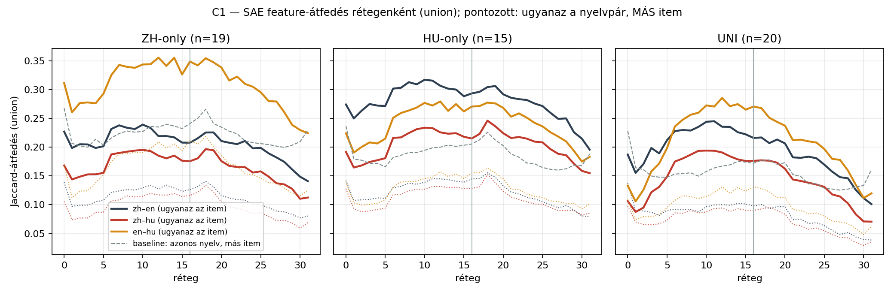
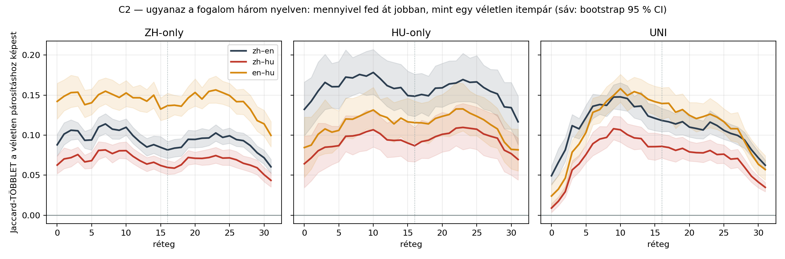
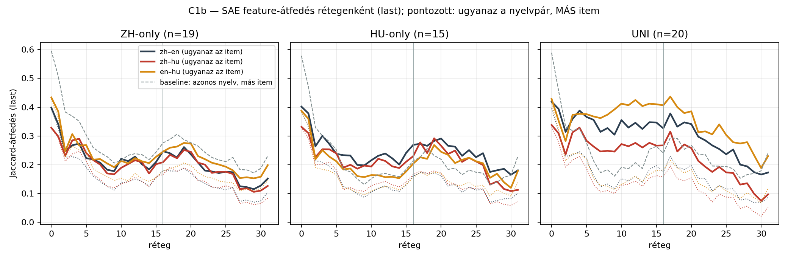

# Mérés C — SAE feature-átfedés a nyelvek között

258 prompt × 32 réteg × 50 aktív feature · modell: **Qwen3.5-9B · chat-sablon** · token-tartomány: **question**.

⛔ A mérés **kizárólag a kérdés tokenjeit** használja, a prompt keretét nem. A base körben a keret a `Kérdés: ` / `
Válasz:` címke (a prompt-tokenek 31 %-a), az instruct körben a chat-sablon burkolata (45 %) — és a keret nyelven belül, az instructnál pedig NYELVEK KÖZT IS bitre azonos, tehát önmagában felnyomná az átfedést. A szűkítés a hatást nem gyengíti, hanem **élesíti**: a base kör UNI zh–en csúcstöbblete a teljes prompton +0,090 volt, a kérdésre szűkítve **+0,129** — a közös keret a VÉLETLEN párosítást emelte jobban, azaz hígította a jelet.

Két halmaz: `last` (a kérdés utolsó tokene) és `union` (a kérdés minden tokenének uniója). Minden állítás a baseline-hoz mért **többletről** szól.

## Eltérések az előregisztrációtól

A runbook §4 három pontján tér el ez a futás. Mindhárom **utólagos**, tehát nem megerősítő erejű — a dolgozat sehol nem hivatkozhat rájuk előre rögzített döntésként.

**E1 — a főeredmény a `union`, nem a `last`.** A §4.1 a `last` halmazt regisztrálta elsődlegesnek, a `union`-t másodlagosnak; ez a riport fordítva közli őket. Az ok az E3 mellékhatása: a kérdésre szűkítés után a `last` a kérdés záró írásjegye (`?` / `？`), ami önmagában alig hordoz tartalmat. A regisztrált `last` ettől nem tűnt el — lentebb mind a 9 cellára közöljük, és a következtetés akkor áll, ha mindkét halmazon áll.

**E2 — 10 000 keverés a regisztrált 1000 helyett**, és derangement (fixpont nélküli permutáció) a sima keverés helyett. Ezer keverésnél a legkisebb elérhető p 1/1001 ≈ 0,001 — ez felbontási határ, nem mérési eredmény, és a korábbi riportban mind a 9 cella ezen a padlóértéken állt. A sima keverés ráadásul fixpontokon át a HELYES párosításokat hagyta volna bent a nullhipotézisben.

**E3 — csak a kérdés tokenjei** (`--span question`), a prompt kerete nélkül. Ez 2026-08-25-i **korrekció**, a teljes promptos futás után: a keret mérési műtermék (ld. a fenti bekezdést), nem elméleti finomítás. Utólagos mivoltát az sem oldja fel, hogy az eredményt élesíti, nem gyengíti.

## Permutációs teszt az előre rögzített 16. rétegen (`union` — ld. E1)

| csoport | nyelvpár | ugyanaz az item | véletlen párosítás | p (nyers) | p (Holm) |
|---|---|---|---|---|---|
| ZH | zh-en | **0.208** | 0.126 | 0.0001 | 0.0009 ✅ |
| ZH | zh-hu | **0.176** | 0.116 | 0.0001 | 0.0009 ✅ |
| ZH | en-hu | **0.349** | 0.212 | 0.0001 | 0.0009 ✅ |
| HU | zh-en | **0.293** | 0.145 | 0.0001 | 0.0009 ✅ |
| HU | zh-hu | **0.215** | 0.128 | 0.0001 | 0.0009 ✅ |
| HU | en-hu | **0.271** | 0.155 | 0.0001 | 0.0009 ✅ |
| UNI | zh-en | **0.216** | 0.098 | 0.0001 | 0.0009 ✅ |
| UNI | zh-hu | **0.176** | 0.090 | 0.0001 | 0.0009 ✅ |
| UNI | en-hu | **0.271** | 0.131 | 0.0001 | 0.0009 ✅ |

⛔ **9/9 cella a felbontási határon áll** (p = 1/10001 = 0.0001): 10 000 keverésből egyetlen sem érte el a megfigyelt átfedést. Ezekben a cellákban a p **felső korlát**, nem mért érték — a valódi p ennél kisebb, a mérés csak ennyit tud felbontani. Több keverés a határt lejjebb viszi, a következtetést nem változtatja.

## Rétegenkénti átfedés és többlet (`union`)

| csoport | nyelvpár | 8. | 16. | 24. | 31. | max. többlet (réteg) |
|---|---|---|---|---|---|---|
| ZH | zh–en | 0.234 (+0.108) | 0.208 (+0.082) | 0.198 (+0.097) | 0.141 (+0.061) | **+0.114** (7.) |
| ZH | zh–hu | 0.192 (+0.077) | 0.176 (+0.060) | 0.156 (+0.071) | 0.112 (+0.044) | **+0.082** (7.) |
| ZH | en–hu | 0.340 (+0.151) | 0.349 (+0.137) | 0.305 (+0.153) | 0.224 (+0.100) | **+0.156** (23.) |
| HU | zh–en | 0.313 (+0.176) | 0.293 (+0.149) | 0.276 (+0.166) | 0.196 (+0.117) | **+0.178** (10.) |
| HU | zh–hu | 0.225 (+0.101) | 0.215 (+0.087) | 0.210 (+0.109) | 0.155 (+0.070) | **+0.110** (23.) |
| HU | en–hu | 0.264 (+0.124) | 0.271 (+0.116) | 0.242 (+0.127) | 0.183 (+0.082) | **+0.133** (23.) |
| UNI | zh–en | 0.229 (+0.137) | 0.216 (+0.118) | 0.181 (+0.112) | 0.101 (+0.062) | **+0.148** (10.) |
| UNI | zh–hu | 0.187 (+0.097) | 0.176 (+0.086) | 0.135 (+0.076) | 0.071 (+0.035) | **+0.108** (9.) |
| UNI | en–hu | 0.256 (+0.142) | 0.271 (+0.139) | 0.208 (+0.122) | 0.120 (+0.057) | **+0.158** (10.) |

## A többlet alakja rétegenként — ez a mérés lényege

| csoport | nyelvpár | többlet a 0–2. rétegen | csúcs (réteg) | az utolsó rétegen |
|---|---|---|---|---|
| ZH | zh–en | +0.098 | **+0.114** (7.) | +0.061 |
| ZH | zh–hu | +0.068 | **+0.082** (7.) | +0.044 |
| ZH | en–hu | +0.148 | **+0.156** (23.) | +0.100 |
| HU | zh–en | +0.143 | **+0.178** (10.) | +0.117 |
| HU | zh–hu | +0.072 | **+0.110** (23.) | +0.070 |
| HU | en–hu | +0.091 | **+0.133** (23.) | +0.082 |
| UNI | zh–en | +0.066 | **+0.148** (10.) | +0.062 |
| UNI | zh–hu | +0.019 | **+0.108** (9.) | +0.035 |
| UNI | en–hu | +0.034 | **+0.158** (10.) | +0.057 |

## ⛔⛔ Kontroll — nem a szó szerinti token-egyezés csinálja?

A korpusz kérdései átírást ÉS eredeti írásjegyet is tartalmaznak (*„Melyik tartományban tisztelik elsősorban **Fazhugong (法主公)** népi istenséget?”*), tehát a magyar prompt szó szerint tartalmazza a kínai sztringet. Ha a feature-többletet ez okozná, a „közös fogalmi tér” állítás megdőlne. Három ellenőrzés:

| csoport | nyelvpár | token-Jaccard (átlag) | Spearman(token-átfedés, feature-többlet) | feature-többlet — mind | …a KIS token-átfedésű felén |
|---|---|---|---|---|---|
| ZH | zh–en | 0.301 | +0.41 | +0.082 | +0.073 (n=10) |
| ZH | zh–hu | 0.257 | +0.28 | +0.060 | +0.055 (n=10) |
| ZH | en–hu | 0.390 | +0.57 | +0.137 | +0.118 (n=10) |
| HU | zh–en | 0.303 | +0.77 | +0.149 | +0.123 (n=8) |
| HU | zh–hu | 0.272 | +0.18 | +0.087 | +0.081 (n=8) |
| HU | en–hu | 0.324 | +0.77 | +0.116 | +0.085 (n=10) |
| UNI | zh–en | 0.307 | +0.47 | +0.118 | +0.107 (n=12) |
| UNI | zh–hu | 0.255 | -0.13 | +0.086 | +0.081 (n=10) |
| UNI | en–hu | 0.298 | -0.02 | +0.139 | +0.146 (n=11) |

## Az előre regisztrált `last` halmaz (E1)

Ez a runbook §4.1 szerinti **elsődleges** halmaz — a kérdés-tartomány UTOLSÓ tokene, vagyis a kérdés záró `?` / `？` írásjegye. Ezen a pozíción szó szerinti tartalmi egyezés nincs, csak a figyelemmel odajutott kontextus (ami a teljes kérdést összegzi, tehát a literális átfedést nem zárja ki teljesen). A `union`-nal együtt olvasandó: a következtetés akkor áll, ha MINDKÉT halmazon áll.

| csoport | nyelvpár | ugyanaz az item (`last`) | véletlen párosítás | p (nyers) |
|---|---|---|---|---|
| ZH | zh-en | **0.247** | 0.181 | 0.0001 |
| ZH | zh-hu | **0.209** | 0.166 | 0.0001 |
| ZH | en-hu | **0.245** | 0.177 | 0.0001 |
| HU | zh-en | **0.269** | 0.160 | 0.0001 |
| HU | zh-hu | **0.229** | 0.166 | 0.0001 |
| HU | en-hu | **0.204** | 0.156 | 0.0001 |
| UNI | zh-en | **0.326** | 0.175 | 0.0001 |
| UNI | zh-hu | **0.267** | 0.157 | 0.0001 |
| UNI | en-hu | **0.407** | 0.182 | 0.0001 |

## Kvalitatív — háromnyelvű, ritka feature-ök

A 13. rétegen (a többlet-csúcsok átlaga) azok a feature-ök, amelyek ugyanarra az itemre MINDHÁROM nyelven aktívak, de a promptok legfeljebb 20 %-án tüzelnek (a gyakoriak a sablon- és nyelv-feature-ök). Összesen **2360** ilyen (feature, item) pár. Az alábbiak ráadásul HÁROM KÜLÖNBÖZŐ sztringen tüzelnek a három nyelven (**976** ilyen) — itt tehát nem a token közös, hanem a fogalom:

| item | feature | hány promptban aktív (258-ból) | mely tokeneken tüzel — kínai / angol / magyar |
|---|---|---|---|
| HU01 (HU) | 21050 | 3 | `场合` / `occasion` / `om` |
| HU01 (HU) | 36540 | 3 | `场合 ？` / `occasion` / `alkal om hoz` |
| HU01 (HU) | 48587 | 3 | `场合` / `occasion` / `hoz` |
| HU03 (HU) | 4685 | 3 | `命` / `judge ?` / `ítás` |
| HU03 (HU) | 7778 | 3 | `奉` / `disguised` / `ruh ában` |
| HU03 (HU) | 27916 | 3 | `法官` / `judge  of` / `ró` |

## Mit mond ez a hipotézisről?

⭐⭐ **A H1 által jósolt alak megjelenik — és a legtisztábban a UNI-csoportban.** Ott a három nyelvi változat felszíni alakja tényleg különbözik (`fotoszintézis` / `photosynthesis` / `光合作用`), tehát szó szerinti token-egyezés alig van: a többlet az embedding környékén még csak **+0.040**, a **9–11. rétegen +0.138** a csúcs, a kimenet felé pedig **+0.051**-ra esik vissza. Vagyis: a nyelvek a bemeneten szétváltak, a középső rétegekben közelednek, a végén újra elválnak — pontosan a „nem fordít, de nem is végig nyelvfüggetlen” kép.

⭐ **Ez az a mérés, amit a logit lens nem tudott elvégezni.** A Mérés B kiderítette, hogy a naiv lens a 0–23. rétegen olvashatatlan; az SAE viszont épp ott, a 7–11. rétegen mutatja a legerősebb nyelvek közti közeledést. A két mérés így nem átfed, hanem kiegészíti egymást.

⛔ **Amit NEM mond:** a többlet abszolút értéke kicsi (a Jaccard 0,19-ről 0,13-ra esne vissza véletlen párosításnál), tehát a reprezentáció **túlnyomó része nyelvspecifikus marad** — a közös fogalmi rész egy réteg a nyelvi jelek tetején, nem a fő jel. És a mérés nem mondja meg, hogy a közös rész ANGOL-e; ahhoz a Mérés D (lefordíthatatlan fogalmak) kell.

⛔ **Korlát:** a ZH- és HU-csoportban a kérdések átírást és eredeti írásjegyet is tartalmaznak, ezért ott a korai rétegek többlete részben szó szerinti token-egyezés (a kontroll-táblában a HU csoport Spearman-értéke +0,18…+0,77). A UNI-csoport ettől mentes — az érvet arra kell építeni.

