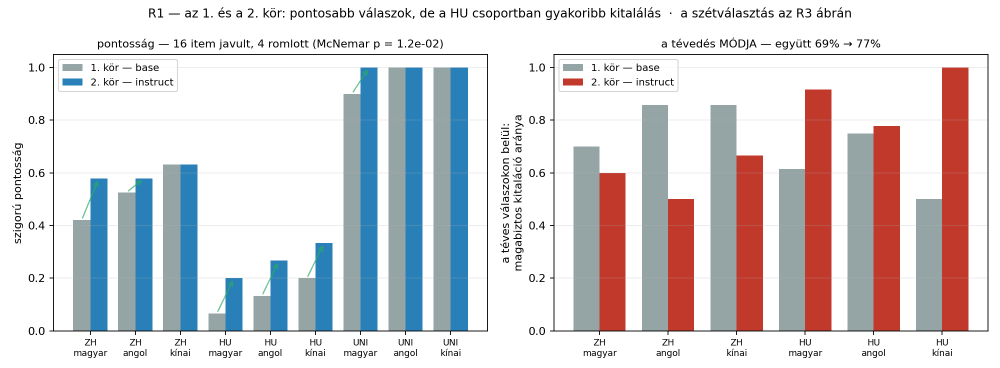
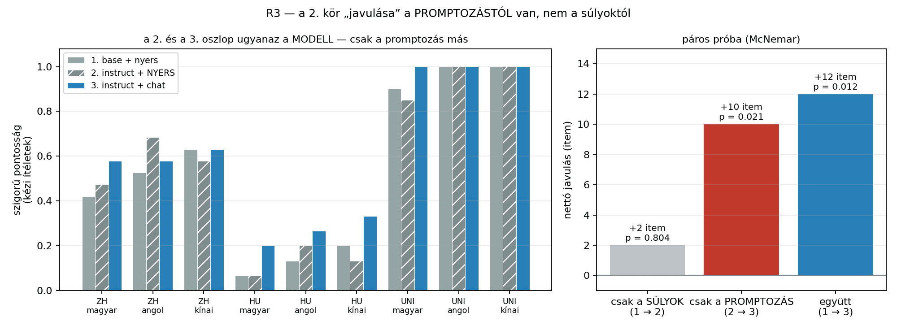
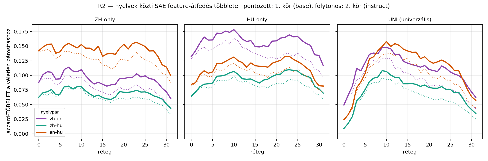

# 1. kör ↔ 2. kör — mit változtat a post-training?

`Qwen3.5-9B-Base` (nyers folytatásos prompt) vs. `Qwen3.5-9B` (instruct, chat-sablon).

## Mi azonos és mi nem

| | |
|---|---|
| **azonos** | a 70 item és a 258 prompt (08-22 óta fagyasztva) · a bíráló (Qwen3.6-35B) · a rubrika · a ellenőrző kört ugyanaz a személy végezte, ugyanazzal a mércével · a token-keret hatásában (fact 200 · UNT/kontroll 800; a base kör magától megállt válaszai kisebb történeti kereten futottak, ami greedy dekódolásnál bitre azonos prefixet ad) |
| **eltér** | a modellsúlyok (base → instruct) · a promptozás (nyers folytatás → chat-sablon) |

⛔ **A promptozás nem választható el a modelltől.** Az instruct modellt chat-sablon nélkül használni nem az ő rendeltetésszerű használata; a különbség tehát a *post-trainelt modell + a hozzá való promptozás* együttes hatása. Ezt a dolgozatban ki kell mondani — a kettőt a kontroll-kör (nyers prompt az instruct modellen) választja szét — az eredménye lentebb, és átértelmezi ezt a különbséget.

## Terepviszonyok — amit a számok olvasásakor tudni kell

| | 1. kör (base) | 2. kör (instruct) |
|---|---|---|
| csonkolt (a keretbe ütközött) | 43/258 (hu 30, en 4, zh 9) | 86/258 (hu 47, en 17, zh 22) |
| ismétlési hurok | 25/258 (hu 14, en 2, zh 9) | 13/258 (hu 0, en 1, zh 12) |
| önértékelő toldalék | 16/258 | 0/258 |

⚠️ **A csonkolás megduplázódott** — az instruct modell bőbeszédűbb, ugyanazon a kereten. Ez a 2. kört LEFELÉ torzítja (a levágott rész tartalmazhatta volna a választ), tehát a lentebb mért javulás inkább **alsó becslés**.

⭐ **A magyar ismétlési hurok eltűnt** és az önértékelő toldalék is: a post-training megszüntette a base „folytasd a dokumentumot” viselkedését. Ezek a 2. kört FELFELÉ torzíthatják, mert az 1. körben ezek elrontottak válaszokat.

---

## Mérés A — pontosság

### Szigorú pontosság („helyes”)

| csoport | magyar | angol | kínai |
|---|---|---|---|
| **ZH** (n=19) | 42% → **58%** (+3 item) | 53% → **58%** (+1 item) | 63% → **63%** (+0 item) |
| **HU** (n=15) | 7% → **20%** (+2 item) | 13% → **27%** (+2 item) | 20% → **33%** (+2 item) |
| **UNI** (n=20) | 90% → **100%** (+2 item) | 100% → **100%** (+0 item) | 100% → **100%** (+0 item) |

### Páros próba (McNemar) — ugyanazok az itemek

Csak a **diszkordáns** párok számítanak: `b→i` = az 1. kör elrontotta, a 2. eltalálta; `i→b` = fordítva.

| csoport / nyelv | b→i (javult) | i→b (romlott) | p (pontos, kétoldali) |
|---|---|---|---|
| ZH / magyar | 4 | 1 | 0.375 |
| ZH / angol | 2 | 1 | 1.000 |
| ZH / kínai | 1 | 1 | 1.000 |
| HU / magyar | 2 | 0 | 0.500 |
| HU / angol | 3 | 1 | 0.625 |
| HU / kínai | 2 | 0 | 0.500 |
| UNI / magyar | 2 | 0 | 0.500 |
| UNI / angol | 0 | 0 | – (nincs diszkordáns pár) |
| UNI / kínai | 0 | 0 | – (nincs diszkordáns pár) |
| **mind a 162** | **16** | **4** | **1.18e-02 ✅** |

⭐⭐ Összesítve **16 item javult és 4 romlott** — az elmozdulás egyértelműen egy irányba mutat (p = 1.2e-02).

⛔ **De ez a szám még NEM a post-training hatása.** A 2. kör a súlyokat és a promptozást EGYSZERRE változtatta; a kettő szétválasztását a lentebbi **kontroll-kör** végzi el — és az eredménye átértelmezi ezt a táblát. Ide csak a kontroll-körrel együtt szabad következtetést fűzni.

---

## A tévedés MÓDJA — ez a legfontosabb különbség

A nem helyes válaszokon belül mekkora a magabiztos kitaláció (`hallucinacio`) aránya? Csak az ellenőrző körrel fedett ZH és HU csoportra értelmes.

| csoport / nyelv | 1. kör | 2. kör |
|---|---|---|
| ZH / magyar | 70% (7/10) | **60%** (3/5) |
| ZH / angol | 86% (6/7) | **50%** (4/8) |
| ZH / kínai | 86% (6/7) | **67%** (4/6) |
| HU / magyar | 62% (8/13) | **92%** (11/12) |
| HU / angol | 75% (9/12) | **78%** (7/9) |
| HU / kínai | 50% (6/12) | **100%** (7/7) |
| **együtt** | 69% (42/61) | **77%** (36/47) |

⛔⛔ **Az összesített szám félrevezet: a két csoportban ELLENTÉTES az irány.**

| csoport | 1. kör | 2. kör | irány |
|---|---|---|---|
| **ZH**-only | 79% (19/24) | **58%** (11/19) | CSÖKKEN — 0 cellában nő, 3-ben csökken |
| **HU**-only | 62% (23/37) | **89%** (25/28) | NŐ — 3 cellában nő, 0-ben csökken |

⭐⭐ **A kitalálás ott nő, ahol a modell a legkevesebbet tudja.** A ZH-only csoportban (amit a modell viszonylag jól tud: 58–63 % pontosság) a post-training **csökkenti** a magabiztos kitalálás arányát. A HU-only csoportban (20–33 % pontosság) viszont **növeli**, méghozzá mind a három nyelven — a HU/kínai cellában a téves válaszok **100 %-a** kitaláció.

Vagyis a post-training nem általában „hallucinálósabbá” tesz: a kitérést és a nem-válaszolást szorítja ki. Ahol van mit mondani, ez javulás; ahol nincs, ott a modell a hallgatás helyett **kitalál**. A hatás tehát épp a kis korpuszú nyelv saját tudásanyagán a legrosszabb.

⚠️ Gyakorlati következtetés a dolgozatba: a felhasználó felé az instruct modell **magabiztosabbnak látszik ott is, ahol nem tud semmit**, és ez a magyar anyagon a legerősebb — pont ott, ahol a magyar felhasználó a legjobban rá lenne utalva.

---

## ⭐⭐ Kontroll-kör — a súlyok vagy a promptozás?

A 2. kör két dolgot változtatott egyszerre: a modellsúlyokat ÉS a promptozást. A kontroll-kör ugyanazt az **instruct modellt** futtatja a base kör **nyers, folytatásos** promptjával (`results_instruct_raw`), így a kettő szétválasztható.

A felbontás a **saját ellenőrző ítéleteimen** (mind a három körben kész) áll.

⚠️ **Korlát a 3. kör ellenőrző köréhez:** a korábbi két kör precedens-naplója nem volt kéznél, amikor ezt a kört pontoztam — csak a kör útmutatójában idézett rubrika. A mérce így elvben elcsúszhatott. Az alábbi **különbségek** ezért óvatosabban olvasandók, mint a gépi bírálón futó változat (amit a `--judge-only` kapcsoló ad vissza).

| | hu | en | zh |
|---|---|---|---|
| **ZH** — 1. base | 42% | 53% | 63% |
| **ZH** — 2. instruct + NYERS prompt | 47% | 68% | 58% |
| **ZH** — 3. instruct + chat-sablon | 58% | 58% | 63% |
| **HU** — 1. base | 7% | 13% | 20% |
| **HU** — 2. instruct + NYERS prompt | 7% | 20% | 13% |
| **HU** — 3. instruct + chat-sablon | 20% | 27% | 33% |
| **UNI** — 1. base | 90% | 100% | 100% |
| **UNI** — 2. instruct + NYERS prompt | 85% | 100% | 100% |
| **UNI** — 3. instruct + chat-sablon | 100% | 100% | 100% |

### Páros próbák — mi mit magyaráz

| lépés | mi változik | javult | romlott | p |
|---|---|---|---|---|
| 1 → 2 | csak a **súlyok** (base → instruct, azonos nyers prompt) | 9 | 7 | 0.804 |
| 2 → 3 | csak a **promptozás** (nyers → chat-sablon, azonos súlyok) | 13 | 3 | 0.021 |
| 1 → 3 | mindkettő együtt | 16 | 4 | 0.012 |

⭐⭐ **A javulás nagy részét a PROMPTOZÁS magyarázza.** A puszta súlycsere nettó +2 itemet hoz, a chat-sablonra váltás **+10**-et; a kettő együtt +12. Vagyis a 2. kör mért javulása **nem elsősorban azt jelenti, hogy az instruct modell TÖBBET TUD** — hanem azt, hogy a chat-sablon előhívja belőle azt, amit a nyers folytatásos prompt nem.

⚠️ Ez a dolgozat egyik legfontosabb módszertani tanulsága: **a „post-training javítja a tudást” állítás promptozási műtermék is lehet**, és csak kontroll-körrel lehet szétválasztani. A base modellt nyers prompttal mérni és az instructot chat-sablonnal mérni NEM azonos mérce.

### A generálási patológiák is a promptozáshoz kötődnek

| | 1. base | 2. instruct + nyers | 3. instruct + chat |
|---|---|---|---|
| ismétlési hurok | 25/258 | 29/258 | 13/258 |
| önértékelő toldalék | 16/258 | 23/258 | 0/258 |

⭐ A base kör két jellegzetes patológiája (ismétlési hurok, saját feladatkiírás a válasz után) az instruct modellen NYERS prompttal **visszatér**, chat-sablonnal **eltűnik**. Tehát ezek sem a súlyok tulajdonságai, hanem a promptozási módé.

### A kitalálás növekedése: a súlyoktól vagy a promptozástól?

Fentebb kiderült, hogy a HU-only csoportban NŐ a magabiztos kitaláció aránya a téves válaszokon belül. A három kör most ezt is szétválasztja.

| csoport | 1. base | 2. instruct + NYERS | 3. instruct + chat |
|---|---|---|---|
| **ZH**-only | 79% (19/24) | 50% (11/22) | 58% (11/19) |
| **HU**-only | 62% (23/37) | 72% (26/36) | 89% (25/28) |

⭐⭐ A HU-only csoportban a kitalálás-arány a súlycserétől +10%-ot, a chat-sablonra váltástól **+17%**-ot mozdul — tehát itt is **a PROMPTOZÁS** a meghatározó. A chat-sablon nem csak a jó válaszokat hívja elő, hanem a **magabiztos rosszakat is**: ott, ahol a modell keveset tud, a nyers prompt mellett még kitér vagy elakad, a chat-sablon mellett viszont határozottan kimondja a téves állítást.

⛔ **Ez az egyetlen eredmény, amit a `--judge-only` futás NEM tud ellenőrizni:** a gépi bíráló a `hallucinacio` kategóriát gyakorlatilag nem használja (162 válaszból 1–2), tehát a kitalálás-felbontás **teljes egészében a ellenőrző köröké**. A pontosság-felbontás viszont a gépi bírálón is ugyanazt adja (súlyok p = 1,000, promptozás p = 0,041), tehát az a rész mérce-független.

---

## Mérés D1 — a lefordíthatatlan fogalmak komponensei

| forrásnyelv | prompt nyelve | 1. kör | 2. kör |
|---|---|---|---|
| hu ← **forrásnyelv** | magyar | 8/22 = 36% | **17/22 = 77%** |
| hu | angol | 10/22 = 45% | **16/22 = 73%** |
| hu | kínai | 11/22 = 50% | **13/22 = 59%** |
| zh | magyar | 13/24 = 54% | **24/24 = 100%** |
| zh | angol | 15/24 = 62% | **23/24 = 96%** |
| zh ← **forrásnyelv** | kínai | 12/24 = 50% | **22/24 = 92%** |

- **hu-forrású fogalmak:** a forrásnyelv az angolhoz képest az 1. körben -9%, a 2. körben **+5%**.
- **zh-forrású fogalmak:** a forrásnyelv az angolhoz képest az 1. körben -12%, a 2. körben **-4%**.

⭐⭐ **Irányváltás:** az 1. körben a forrásnyelv MINDKÉT irányban gyengébb volt az angolnál — ez volt a „nincs forrásnyelvi előny” eredmény. A 2. körben a hu-forrású fogalmaknál a magyar prompt már a legjobb, a zh-forrásúaknál pedig mindhárom nyelv 90 % fölé megy, tehát a különbség eltűnik. **A post-training kiegyenlíti a nyelveket.**

⚠️ Korlát: 8+8 fogalom, a komponenslistákat én definiáltam; ez kvalitatív-illusztratív mérés. A számszerű alapot a Mérés C adja.

---

## Mérés C — nyelvek közti SAE feature-átfedés (a kérdés tokenjein)

A véletlen párosításhoz mért TÖBBLET csúcsa. Ez a dolgozat legszigorúbb, reprezentáció-szintű mérőszáma.

| csoport | nyelvpár | 1. kör | 2. kör |
|---|---|---|---|
| HU | en-hu | +0.120 (10. réteg) | **+0.133** (23. réteg) |
| HU | zh-en | +0.163 (10. réteg) | **+0.178** (10. réteg) |
| HU | zh-hu | +0.098 (10. réteg) | **+0.110** (23. réteg) |
| UNI | en-hu | +0.137 (11. réteg) | **+0.158** (10. réteg) |
| UNI | zh-en | +0.129 (11. réteg) | **+0.148** (10. réteg) |
| UNI | zh-hu | +0.095 (9. réteg) | **+0.108** (9. réteg) |
| ZH | en-hu | +0.145 (2. réteg) | **+0.156** (23. réteg) |
| ZH | zh-en | +0.101 (7. réteg) | **+0.114** (7. réteg) |
| ZH | zh-hu | +0.079 (6. réteg) | **+0.082** (7. réteg) |

⭐⭐ **9/9 nyelvpáron nőtt a többlet.** A post-training tehát nem angol-központúbbá teszi a modellt, hanem **erősíti a nyelvfüggetlen fogalmi reprezentációt**.

⚠️ A csúcs RÉTEGE nem stabil: mediánja 10 → 10, de 3 nyelvpár csúcsa a 2. körben a 15. réteg fölé csúszik. **Ez azonban nem valódi rétegváltás:** a görbe ott lapos — a globális csúcs alig magasabb a 8–12. réteg lokális maximumánál.

| nyelvpár | globális csúcs | a 8–12. réteg maximuma | különbség |
|---|---|---|---|
| HU/en-hu | +0.133 (23. réteg) | +0.131 (10. réteg) | **+0.0013** |
| HU/zh-hu | +0.110 (23. réteg) | +0.107 (10. réteg) | **+0.0028** |
| ZH/en-hu | +0.156 (23. réteg) | +0.153 (10. réteg) | **+0.0037** |

Vagyis **a csúcs rétegére önmagában nem szabad állítást építeni**; a 9–11. rétegbeli púp mindkét körben megvan, a görbe alakját a C1/C2 ábrákon kell nézni.

---

## Összefoglalás

| kérdés | válasz |
|---|---|
| Javul-e a faktuális pontosság? | **Igen** (16 item javult, 4 romlott, p = 1.2e-02) — de **nem a súlyoktól**, ld. a következő sort |
| Mitől javul: a súlyoktól vagy a promptozástól? | ⭐⭐ **A promptozástól.** A puszta súlycsere nettó +2 item (p = 0.804, azaz semmi), a chat-sablonra váltás **+10** item (p = 0.021) |
| Angol-központúbb lesz-e a reprezentáció? | **Nem** — a nyelvek közti feature-átfedés-többlet mind a 9 nyelvpáron nőtt (a csúcs RÉTEGÉRE nem építünk állítást, ld. fentebb) |
| Eltűnik-e a forrásnyelv hátránya? | **Igen**, a D1-ben irányt vált |
| Csökken-e a hallucináció? | **Csoportfüggő** — a téves válaszokon belül a magabiztos kitaláció aránya a ZH-only csoportban 79% → **58%** (csökken), a HU-only csoportban 62% → **89%** (NŐ). Ahol a modell keveset tud, ott a hallgatás helyett kitalál |

⛔ **Maradó korlátok:** a csonkolás a 2. körben megduplázódott (86 vs. 43/258), ami a mért javulást inkább alsó becsléssé teszi; a 3. kör ellenőrző körét a korábbi precedens-naplóim nélkül pontoztam, tehát a mérce elvben elcsúszhatott (a pontosság-felbontást ez nem érinti, mert a gépi bírálón is ugyanaz jön ki); és mindez EGY modellcsalád EGY méretén, 70 itemen mérve.

⚠️ **Amit a három kör NEM választ szét:** a chat-sablon és a post-training együtt jár a gyakorlatban — nincs olyan valós használat, ahol az instruct modellt nyers folytatásos prompttal etetnék. A 3. kör tehát **mérési kontroll, nem használati forgatókönyv**: azt mutatja meg, hogy a 2. kör javulása MIBŐL ered, nem azt, hogy a post-training fölösleges volna. A chat-sablon épp a post-training terméke — a súlyok teszik, hogy a modell egyáltalán reagál rá.

