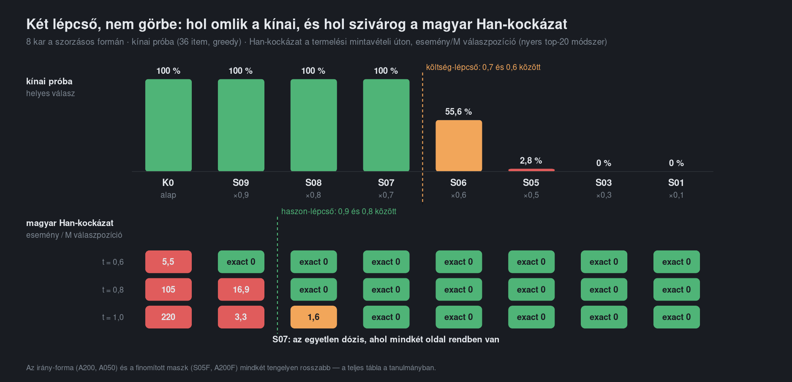
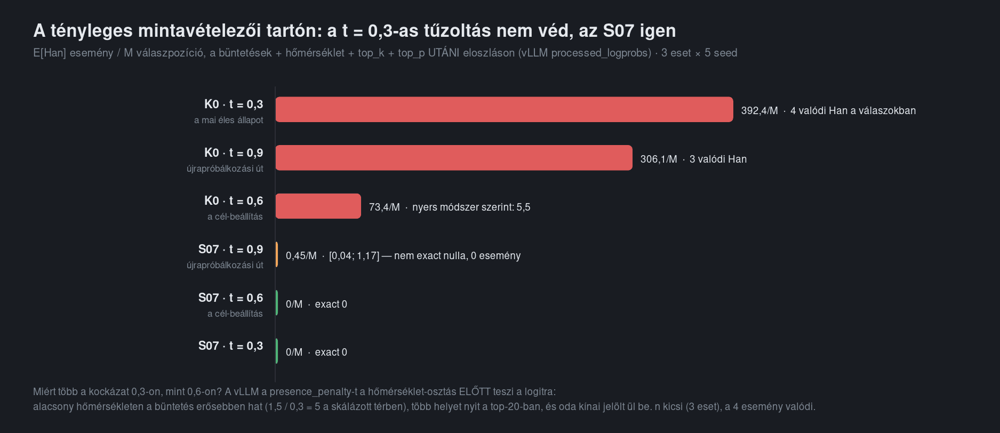

# How much may be taken from a token class? — CJK damping in the output head of Qwen3.6-35B-A3B-FP8, a dose–response study

**Date:** 2026-09-18 → 2026-09-20 · **Reproducibility:** R1 (code + synthetic corpus + per-arm
outputs on the synthetic corpus; the three customer agent traces behind the risk numbers are not
public) · **Card:** [eval-card.yaml](eval-card.yaml) · **Decision:**
[decision-record.md](decision-record.md) · **Pre-registered protocol (Hungarian):**
[protocol/00-runbook.md](protocol/00-runbook.md) · **Model:**
`Qwen3.6-35B-A3B-FP8-cjk-damped-S07` (Hugging Face)

> A Hungarian document agent, run with sampling, occasionally switched to Chinese function words
> mid-answer. A known fix rescales the CJK rows of the output matrix. This measurement asks the
> question nobody had answered: **how much may be taken, and what does it cost — in Hungarian and
> in Chinese?** Twelve arms, six instruments, a pre-registered protocol, and three findings that
> changed the protocol itself along the way.

---

## 1. What was the measurement for?

Two production decisions. First, whether a weight-level intervention (`lm_head` row scaling,
from [dnotitia/smoothie-qwen](https://github.com/dnotitia/smoothie-qwen)) can replace the
firefight we were running — the cron path's temperature lowered from 0.6 to 0.3 — so that
sampling can go back to 0.6. Second, which *dose* and which *form* (multiplicative scaling vs.
the direction-based row replacement of
[ThakiCloud/Qwen3.8-27B-ko-cjk-suppressed](https://huggingface.co/ThakiCloud/Qwen3.8-27B-ko-cjk-suppressed))
pays the least for the same benefit. The protocol, hypotheses H1–H6 with refutation criteria,
the primary endpoints, the statistics and the publication rule were fixed on 2026-09-15 before
any arm ran; every later change is dated in the protocol's log (`Napló`).

## 2. On what task and dataset?

| instrument | what it measures | n | public |
|---|---|---|---|
| **Han-risk probe** (benefit) | expected CJK tokens per million generated positions, from top-20 log-probs at every position, under the production sampler (`t 0.6 / top_p 0.95 / top_k 20 / presence 1.5 / repetition 1.05`), at `t = 0.6, 0.8, 1.0`; answer-level bootstrap CI | 3 Hungarian agent traces (13–19 k tokens), 3–5 repeats × 3 temperatures per arm | **no** (customer traces); aggregates in `results/risk/` |
| **Hungarian trap corpus** (cost, then negative control) | item-level pass rate on 150 extraction/judgement items over 16 synthetic Hungarian documents (50 original + 100 written for this study from real failure classes), greedy | 150 items, serial, 1× (3× on the control) | **yes** — `dataset/trap-corpus/` |
| **Chinese probe** (cost) | exact-match accuracy on 36 short Chinese tasks in 7 categories; and the share of answers with *no* CJK character at all | 36 items, greedy | **yes** — `dataset/chinese-probe/` |
| **Trap corpus under the production sampler** (F3) | the same 150 items at `t = 0.6` with the full production sampler, top-20 log-probs recorded → ~230 000 Hungarian positions of risk measurement on non-customer text | 150 × 3 | **yes** — `results/f3/` |
| internal KIE and contract extraction | confirmatory only (§7/3 of the protocol) | 34 + 30 documents | **no** |

Corpus and probe hashes: [corpus_manifest.json](corpus_manifest.json).

## 3. Which models and configurations were compared?

One base checkpoint, `Qwen/Qwen3.6-35B-A3B-FP8`, and eleven single-tensor patches of its
`lm_head.weight` (`results/arms/*.json` are the build records; `code/patch_lm_head.py` builds
them, `code/ellenoriz_kar.py` verifies each at file, tensor and row level):

| arm | form | mask | parameter |
|---|---|---|---|
| `S09 S08 S07 S06 S05 S03 S01` | multiplicative scaling `W[i] := S·W[i]` | raw (55 424 rows: every token containing a CJK ideograph or CJK punctuation, definition from smoothie-qwen) | S = 0.9 … 0.1 |
| `A200 A050` | direction replacement `W[i] := −α·μ_h/‖μ_h‖²`, `μ_h` = mean final hidden state on Hungarian text (`dataset/mu-h-A.json`) | raw | α = 2.0, 0.5 |
| `S05F A200F` | as above | refined (54 939 rows: Korean-style — kana, only-simplified characters, multi-character Han; leaves 3 964 frequent single ideographs untouched) | S = 0.5 / α = 2.0 |

Engine: vLLM `0.19.1rc1.dev328+g18013df6a` (the "beta" build the round-5 replication was made
on; base image digest `sha256:10c361c5…`), FP8 KV cache, MTP speculative decoding (2 draft
tokens), prefix caching, one DGX Spark (GB10). The FP8 weights were never de-quantised.

## 4. Which metrics?

- **Primary benefit:** position-wise expected CJK count `E[Han] = Σ p_CJK` per million answer
  positions, answer-level bootstrap 95 % CI (2 000 resamples). "Exact 0" means every position had
  zero CJK mass inside the truncated sampling support. The observed-event Poisson upper bound is
  reported next to it (protocol §5: "0/M on its own is not a result").
- **Primary cost (as registered):** item-level pass rate on the trap corpus, Wilson CI, paired
  McNemar against the control, non-inferiority margin −2 items on the 150 scale.
- **Cost (as it turned out to matter):** Chinese-probe accuracy and no-CJK share, paired McNemar,
  Holm-corrected over arms.
- Multiple comparisons: Holm over the eight (later eleven) control-vs-arm tests per endpoint.

## 5. What was the result?

The full sheet is [results/eredmenylap.txt](results/eredmenylap.txt) (all twelve arms, nothing
dropped). The short version:

| arm | Chinese probe | no-CJK answers | Han risk `t=0.6` | `t=0.8` | `t=1.0` |
|---|---|---|---|---|---|
| `K0` base | 36/36 | 0 % | 5.5/M | 105/M | 220/M |
| `S09` | 36/36 | 0 % | exact 0 | **16.9/M** | 3.3/M |
| `S08` | 36/36 | 0 % | exact 0 | exact 0 | 1.6/M |
| **`S07`** | **36/36** | 0 % | **exact 0** | **exact 0** | **exact 0** |
| `S06` | 20/36 (55.6 %) | 44 % | exact 0 | exact 0 | exact 0 |
| `S05` | 1/36 | 97 % | exact 0 | exact 0 | exact 0 |
| `S03`, `S01`, `A200` | 0/36 | 100 % | exact 0 | exact 0 | exact 0 |
| `A050` | 0/36 | 97 % | exact 0 | exact 0 | exact 0 |
| `S05F` | 7/36 (19.4 %) | 44 % | exact 0 | 10.8/M | 11.3/M |
| `A200F` | 1/36 | 86 % | 4.3/M | 39.3/M | 2.6/M |



1. **The dose–response is two cliffs, not a curve.** Chinese survives intact down to S = 0.7 and
   collapses between 0.7 and 0.6 (100 % → 55.6 % → 2.8 %). The CJK risk on the production path
   is exactly zero from S = 0.8 downward; S = 0.9 already leaks at `t = 0.8`. **`S07` is the
   smallest dose with both** — it sits at the edge of the cost cliff, one step inside the
   benefit edge.
2. **The Hungarian trap corpus is a null instrument for this intervention — by construction.**
   The patch changes only CJK-row logits, which are never the argmax on Hungarian text, so the
   greedy Hungarian output of an arm is **byte-identical** to a control served in the same
   instance mode on all 150 items. This is *measured* for eight patches (including S = 0.1);
   `S08`/`S06` (byte-identical to each other) and `A050` landed in instance modes for which no
   control run exists, so there the property is derived, not measured. Under sampling, output can differ only
   where a CJK token was inside the truncated support — i.e. exactly at the risk positions. The
   non-target-language cost is therefore bounded above by the non-target-language risk. H1 ("a
   strong dose costs Hungarian") is refuted for every dose; the cost lives entirely in Chinese.
3. **Neither the direction form nor the refined mask is a better trade.** α = 0.5 already
   kills Chinese; the refined mask keeps Chinese at 19 % (not usable) and does not zero the risk
   (H3, H4 refuted). The mechanism claim of the direction form holds (raw CJK mass exactly 0),
   its cost claim does not.
4. **The sign trap is real and the fix depends on the sampler.** 96.4 % of targeted rows have
   negative logits on Hungarian text; scaling moves them *towards zero*, so the raw CJK mass at
   `t = 1.0` *rises* (10.5 % → 13.4 % at S = 0.7 → 16.1 % at S = 0.5). The zeros are produced by
   `top_k = 20` truncation. Without a truncating sampler the patch does not help (H6).
5. **Confirmation on the actual sampling support (F3).** The table's risk numbers come from raw
   top-20 log-probabilities; vLLM applies penalties *before* top-k, so they are lower bounds.
   Re-measured with `--logprobs-mode processed_logprobs`: the base is about an order of
   magnitude worse than the table (a ratio of point estimates — 5.5 and 12/M raw vs 73/M
   [15; 148] actual — from three traces on different instances, not a measured factor)
   (`t=0.6`: 73/M; **`t=0.3`: 392/M with 4 real CJK tokens in 7 869 answer positions** — the
   temperature firefight does not remove the risk, because a penalty applied before the
   temperature division bites harder at low temperature), while `S07` stays exact 0 at `t=0.6`
   and `0.3` and shows 0.45/M [0.04; 1.17] on the retry path (`t=0.9`, `presence 1.8`) — a *lower bound*:
   with `top_p = 1.0`, ties at the top-k boundary keep more than 20 candidates at ~4 % of
   positions, so the recorded top-20 does not cover the whole support there. Over three
   fresh server instances, 15 seeds × 3 profiles, a concurrent batch and the 150 documents under
   the production sampler, `S07` produced **zero** CJK tokens anywhere; the base produced 65 on the same seeds.
   **Post-closure self-check (2026-09-20):** the risk calculator skips records that never reach
   a final answer (tool-call turns, runaway generations). Recounting *every* record
   (`code/han_ujraszamol_mind.py`, `results/f3/ujraszamolas-minden-rekord.txt`): `S07` is still
   at zero generated CJK tokens over ~1.09 M distinct positions (Poisson 95 % upper bound
   < 2.8/M), while the base additionally produced **6 593 CJK tokens in one runaway generation**
   on the retry profile. On that same seed `S07` also ran away (to the 65 536-token limit, without
   CJK): the retry profile (`t=0.9`, `top_p=1.0`) degenerates in 2 of 15 runs with or without the
   patch — the patch removes the CJK tokens, not the degeneration.



## 6. What product decision followed?

`S07` is proposed for a small, reversible production canary at `t = 0.6`, with CJK occurrence
and task quality monitored — see [decision-record.md](decision-record.md). The published
checkpoint is `Qwen3.6-35B-A3B-FP8-cjk-damped-S07`; its model card carries the whole table above
and the sampler caveat.

## 7. What are the limits of the measurement?

- **Server-instance non-determinism.** Greedy output is bit-stable within one vLLM process but
  differs between fresh processes on knife-edge items (2–5/150; at least five discrete numeric
  "modes" over 16 starts; `results/validation/`). Batch size flips the same items. All published
  greedy numbers were measured serially; arm differences on the trap corpus identify the instance
  mode, not the patch. `VLLM_BATCH_INVARIANT=1` + `--attention-backend TRITON_ATTN` was verified
  reproducible across instances and batch sizes (~12 % slower) but was not used for the
  published numbers (decision, protocol log 2026-09-19).
- **Three customer traces** carry the Hungarian agent-trace risk numbers; the 150-document run
  under the production sampler is the public, larger counterpart (answers are short JSON, so most
  of its positions are in the thinking segment).
- **Chinese only** on the cost side; kanji and hanja share the mask but were not measured.
- **Nothing between S = 0.6 and 0.7**, and `S08` was not re-measured on the actual support.
- The Poisson bounds on observed events are 300–1 100/M per arm — the exact-zero claims rest on
  the position-wise mass, not on event counts.
- One model, one quantisation, one engine, one hardware.

## 8. Which DocAI article belongs to it?

- Study (Hungarian, long form): https://docai.hu/kutatas/cjk-csillapitas
- Blog (Hungarian, short form): https://docai.hu/blog/kinai-szavak-a-magyar-valaszban

## Layout

```text
protocol/     the pre-registered runbook and the F0–F3 lab journals (Hungarian; primary sources)
code/         patch, masks, μ_h, risk calculator, trap harness + scorer, Chinese probe, orchestrators
dataset/      trap corpus (16 documents, 150 items), Chinese probe (36 items), μ_h probe sets and vectors, token masks
results/      eredmenylap.{txt,json} (all arms) · risk/ · chinese/ · trap/ · f3/ · arms/ · validation/
figures/      the study's figures
```
